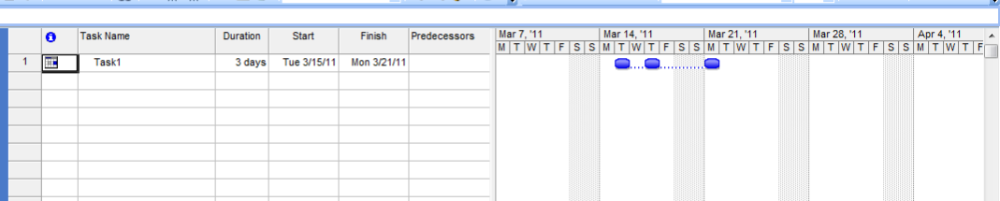

{} 

Sometimes it is not possible to complete a task as scheduled and it needs to be split into two or more parts. Aspose.Tasks support this Microsoft Project feature.

{} 
## **Splitting Tasks**
The SplitParts property exposed by the [Task](https://apireference.aspose.com/tasks/java/com.aspose.tasks/Task/) class is used to determine the split parts of a task whereas the SplitTask method exposed by the ResourceAssignment class is used to split a single task into multiple parts. SplitParts returns a collection of split parts whereas the SplitTask method accepts start date, finish date and calendar arguments to split the task.
### **Splitting and Viewing Tasks in Microsoft Project**
To split a task in Microsoft Project:

1. Identify a long task and you want to divide.
2. On the **Task** menu, select the **Schedule** group and click **Split Task**.
3. Click at the position you want to split the task.

To see split tasks in Microsoft Project:

1. On the **View** menu, select **Gantt Chart**.
   Split tasks are linked by a dotted line. 
   **Split tasks in Microsoft Project** 

### **Creating and Splitting Task**
To create and split a task, follow these steps:

1. Create a new project.
2. Create and assign a new calendar to the project.
3. Create and add a new task in the project.
4. Create and add a new resource assignment in the project.
5. Use the SplitTask method exposed by the ResourceAssignment class to split the task.
6. Write the new project to the disk.

The following code shows how to accomplish these tasks:


