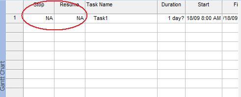

{} 

A tasks' stop date is the date that it should (or did) end. Sometimes, a task has to be stopped temporarily and then resumed later. Microsoft Project can calculate stop dates, or let users enter them manually.

{} 
## **Working with Stopped and Resumed Tasks**
The STOP and RESUME properties exposed by the [Tsk](https://apireference.aspose.com/tasks/java/com.aspose.tasks/Tsk/) class are used to read or write a task's stop and resume date:

- STOP: the date a task stops (Date).
- RESUME: the data and time a task restarts (Date).
### **Microsoft Project view of Stop and Resume Dates**
To see a task's stop and resume dates:

1. In the Task Entry form, on the **Inset** menu, select **Column**.
1. Add the Stop and Resume columns.

**The Stop and Resume columns in Microsoft Project** 

### **Getting Stop and Resume Dates**
The stop and resume dates are not available if the task has never stopped. For date values equal to NA, Aspose.Tasks take the value "1/1/2000" if you're using the evaluation version. When fully licensed, Aspose.Tasks uses DateTime.MinValue for NA values. The following examples display's the stop and resume dates for all the tasks in a project.


