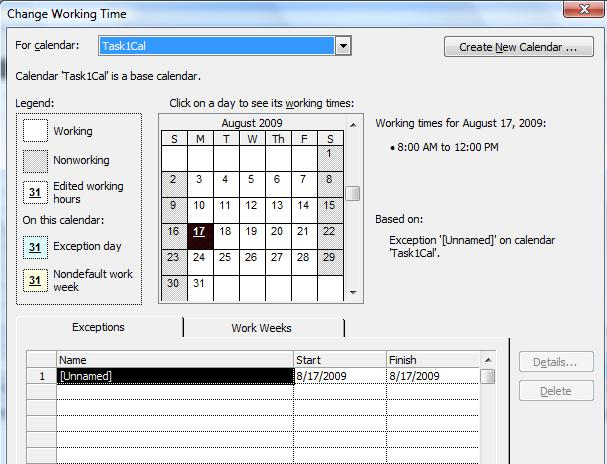

{} 

It is possible to associate calendars with particular tasks in Microsoft Project. Aspose.Task supports this functionality.

{} 
## **Tasks with Calendars**
The [Task](http://www.aspose.com/api/java/tasks/com.aspose.tasks/classes/Task) class exposes the [Calendar](http://www.aspose.com/api/java/tasks/com.aspose.tasks/classes/Calendar) property, used to set or get the calendar associated with a task. This property accepts or returns an com.aspose.tasks.Calendar object.

To create a calendar for a task in Microsoft Project:

1. Open a project in Microsoft Project.
1. On the **Project** menu, select **Change Working Times**, then **Create New Calendar**.
1. To assign the calendar to a task, double-click the task in the Task Entry form.
1. Select the **Advanced** tab.

**The Change Working Time dialog showing a custom-made calendar** 

### **Setting Task Calendar**
Create a standard calendar and create a task. Assign the Calendar to the task.


### **Getting Task Calendar**
Get task calendar by traversing the tasks in a project.


