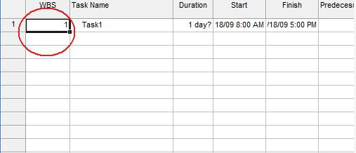

{} 

WBS codes, work breakdown structure codes, lets you assign outline numbers to tasks according to the needs of your business. It's a method for applying a customized outline scheme to a project. Aspose.Tasks supports this feature.

{} 
## **Working with Work Breakdown Structure**
The WBS and WBSLevel properties exposed by the [Tsk](https://apireference.aspose.com/tasks/java/com.aspose.tasks/Tsk/) class is used to read and write a tasks work breakdown structure:

- WBS: sets or gets a task's WBS code (string).
- WBS_LEVEL: sets or gets a task's WBS level (string).
### **Microsoft Project View of WBS**
To view WBS information in Microsoft Project:

1. On the Task Entry Form, select the **Insert** menu and then **Column**.
2. Add the WBS column.

**Work breakdown structure in Microsoft Project** 

### **Getting WBS in Aspose.Tasks**
The following examples show how to get a task's WBS value using Aspose.Tasks.


## **Renumber WBS Codes**
Aspose.Tasks API can renumber WBS codes similar to MSP's "Renumber" function.


