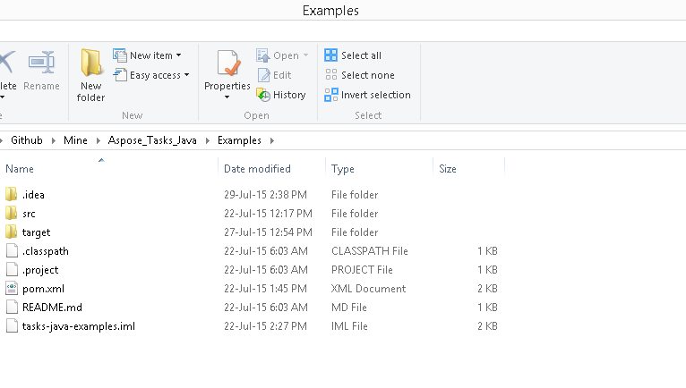
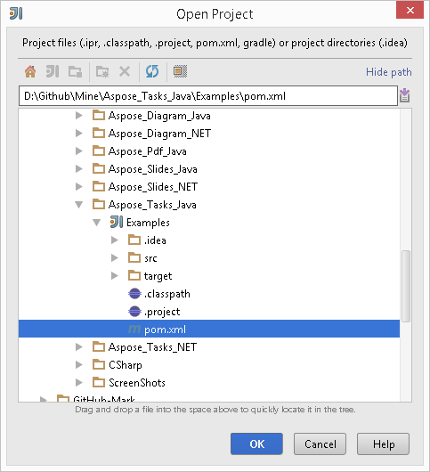
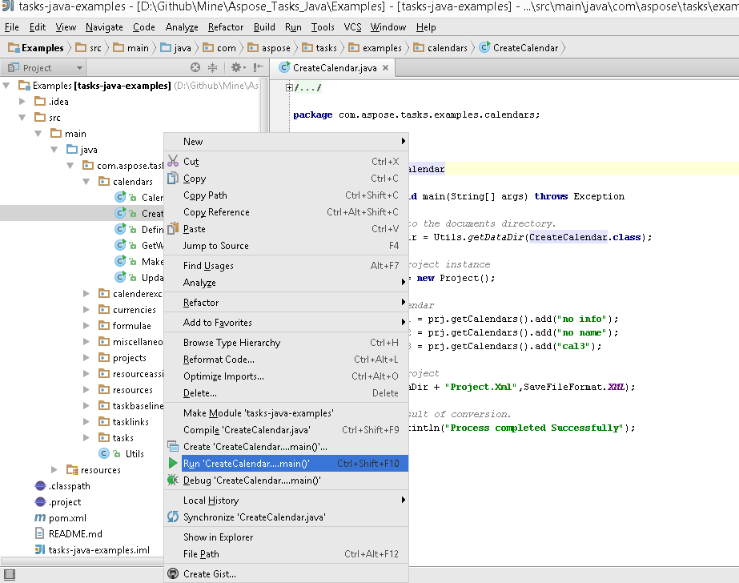
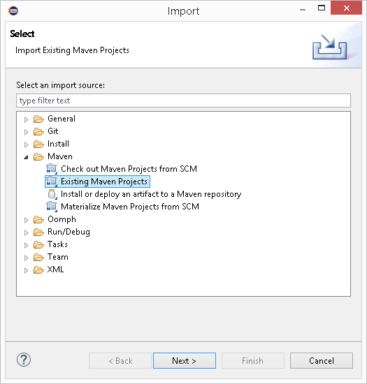
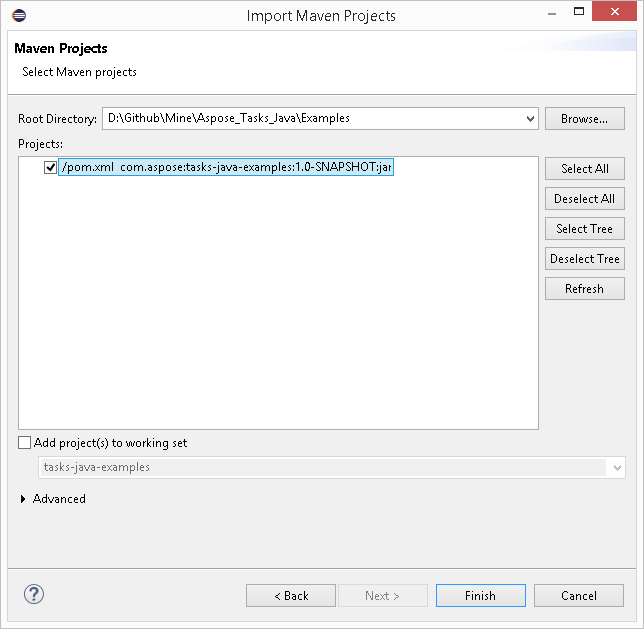
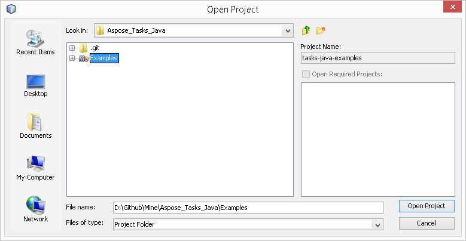
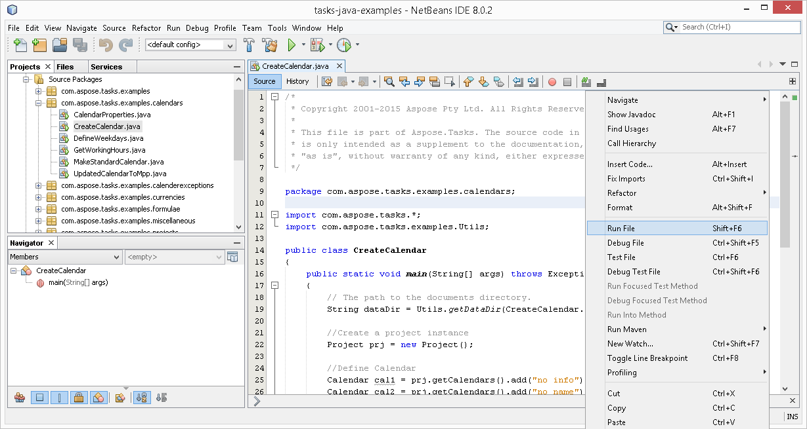

## **Download from GitHub**
All examples of Aspose.Tasks for Java are hosted on [GitHub](https://github.com/aspose-tasks/Aspose.Tasks-for-Java). You can either clone the repository using your favorite GitHub client or download the ZIP file from [here](https://github.com/aspose-tasks/Aspose.Tasks-for-Java/archive/master.zip).

Extract the contents of the ZIP file to any folder on your computer. All the examples are located in the **Examples** folder.

The project uses the Maven build system. Any modern IDE can easily open or import the project and its dependencies. Below we show you how to use popular IDEs to build and run the examples.

## **IntelliJ IDEA**
Click on the **File** menu and choose **Open**. Browse to the project folder and select the **pom.xml** file.

It will open the project and download the dependencies automatically. From the Project tab, browse the examples in **src/main/java** folder. To run an example, just right-click on the file and choose "Run ..", the example will be executed and the output will be shown in the built-in console output window.

## **Eclipse**
Click on the **File** menu and choose **Import**. Select **Maven** - Existing Maven Projects.

Browse to the folder that you cloned or downloaded from GitHub and select **pom.xml** file.

It will open the project and download the dependencies automatically. From the Package Explorer tab, browse the examples in the **src/main/java** folder. To run an example, just right click on the file and choose **Run As** - **Java Application**, the example will be executed and the output will be shown in the built-in console output window.

## **NetBeans**
Click on the **File** menu and choose **Open Project**. Browse to the folder that you cloned or downloaded from GitHub. The icon of the **Examples** folder will show that it is a Maven project. Select Examples and open it.

It will open the project and download the dependencies automatically. From the Projects tab, browse the examples in **source packages**. To run an example, just right click on the file and choose **Run File**, the example will be executed and the output will be shown in the built-in console output window.

## **How to contribute**
If you like to add or improve an example, we encourage you to contribute to the project. All examples and showcase projects in this repository are open source and can be freely used in your applications.

To contribute, you can fork the repository, edit the source code and create a pull request. We will review the changes and include it in the repository if found helpful.
