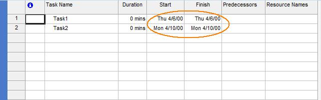

## **Evaluate Aspose.Tasks**
A free evaluation version of Aspose.Tasks for Java can be downloaded from [download section](https://downloads.aspose.com/tasks/java) of Aspose.Tasks for Java.

{}
If you want to test Aspose.Tasks without evaluation version limitations, you can also request a 30 Day Temporary License. Please refer to [How to get a Temporary License](https://purchase.aspose.com/temporary-license)?
{}

### **PDF Creator Information**
Please note that you cannot set values against the **Application** and **Producer** fields, because Aspose Ltd. and Aspose.Tasks for Java x.x.x will be displayed against these fields.

### **Limitations**
The evaluation version provides all the features except the following:

#### **DateTime Limitation**
The date year will be converted to 2000 in the projects that will be written through Aspose.Tasks for Java as explained in the following code example. This example tries to create a project with two tasks through Aspose.Tasks for Java without using a license file.

The project file created from the code looks like the one below in Microsoft Project. Note that the Start and Finish dates for Task1 have been converted from 06-Apr-2010 to 06-Apr-2000. Similarly, the Start and Finish dates for Task2 have been converted from 10-Apr-2010 to 10-Apr-2000. These dates are written with the same original year if the project is created using a [licensed version of Aspose.Tasks for Java](https://docs.aspose.com/tasks/java/licensing/#applying-the-license).

## **Date changes in the evaluation version of Aspose.Tasks** 


java.util.Calendar calendar = java.util.Calendar.getInstance(TimeZone.getTimeZone("GMT"));
calendar.set(2010, java.util.Calendar.APRIL, 6, 0, 0, 0);
Date startDate = calendar.getTime();
Project prj = new Project();
Task rootTsk = new Task();
Task tsk1 = new Task("Task1");
tsk1.setActualStart(startDate);
calendar.set(2010, java.util.Calendar.APRIL,10,0,0,0);
startDate = calendar.getTime();
Task tsk2 = new Task("Task2");
tsk2.setActualStart(startDate);
//Add tsk1 and tsk2 to the rootTsk
rootTsk.getChildren().add(tsk1);
rootTsk.getChildren().add(tsk2);
//Set rootTsk as root task of the project
prj.setRootTask(rootTsk);
//Perform recalculations
prj.calcTaskIds();
prj.calcTaskUids();
//Save the Project as XML
prj.save("ResultingProject.xml", SaveFileFormat.XML);


### **MPP Write Support**
Aspose.Tasks for Java supports reading MPP files, updating the project summary information and then writing updated project files in original the MPP format. That is, if original MPP format belongs to Microsoft Project 2003 version, the MPP file updated through Aspose.Tasks for Java will also be in Microsoft Project 2003 MPP format. The same is valid for Microsoft Project 2007, 2010 and 2013 MPP formats. However, this support is only available in licensed versions of Aspose.Tasks for Java.

## **Applying the License**
You can download an evaluation version of **Aspose.Tasks** for Java from [its download page](https://downloads.aspose.com/tasks/java). The evaluation version provides absolutely the same capabilities as the licensed version of the product. Furthermore, evaluation version simply becomes licensed when you purchase a license and add a couple of lines of code to apply the license.

Once you are happy with your evaluation of **Aspose.Tasks for Java**, you can [purchase a license](https://purchase.aspose.com/buy) at the Aspose website. Make yourself familiar with the different subscription types offered. If you have any questions, do not hesitate to contact the Aspose sales team.

Every Aspose license carries a one-year subscription for free upgrades to any new versions or fixes that come out during this time. Technical support is free and unlimited and provided both to licensed and evaluation users.

If you want to test **Aspose.Tasks** without evaluation version limitations, request a 30-day temporary license. Please refer to [How to get a Temporary License?](https://purchase.aspose.com/temporary-license) for more information.

### **Setting a License**
The license is a plain text XML file that contains details such as the product name, number of developers it is licensed to, subscription expiry date and so on. The file is digitally signed, so do not modify the file; even the inadvertent addition of an extra line break into the file will invalidate it.

You need to set a license before utilizing **Aspose.Tasks** if you want to avoid its evaluation limitations. You are only required to set a license once per application or process.

The license can be loaded from a stream or file in the following locations:

1. Explicit path.
2. The folder that contains the Aspose.Tasks.jar.

Use the [License](https://apireference.aspose.com/tasks/java/com.aspose.tasks/license).setLicense method to license the component. Often the easiest way to set a license is to put the license file in the same folder as Aspose.Tasks.jar and specify just the file name without path as shown in the following example:

**Example 1**

In this example Aspose.Tasks will attempt to find the license file in the folder that contain the JARs of your application.


com.aspose.tasks.License license = new com.aspose.tasks.License();
license.setLicense("Aspose.Tasks.Java.lic");


**Example 2**

Initializes a license from a stream.


com.aspose.tasks.License license = new com.aspose.tasks.License();
license.setLicense(new java.io.FileInputStream("Aspose.Tasks.Java.lic"));

