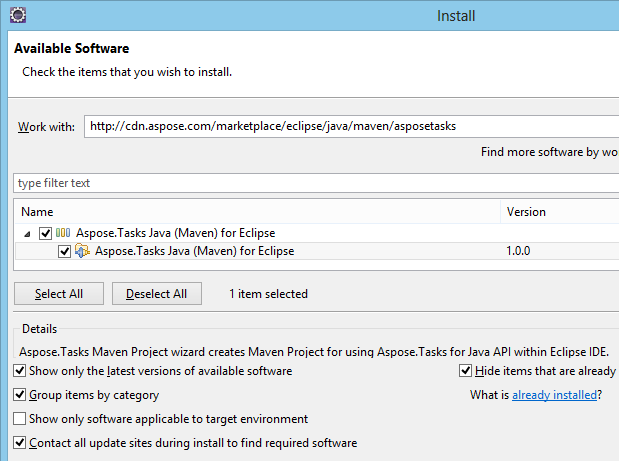
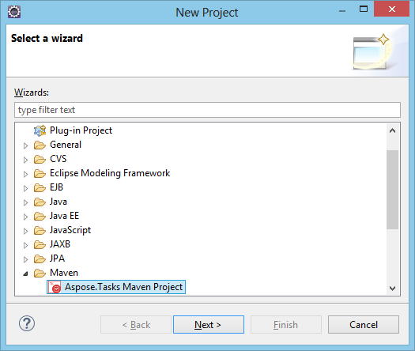
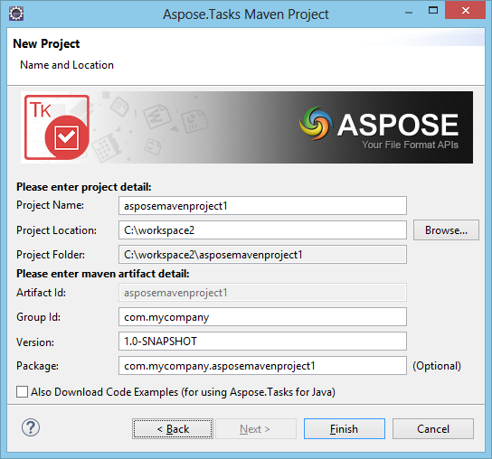
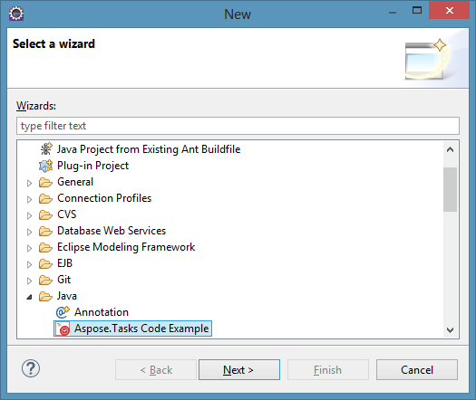
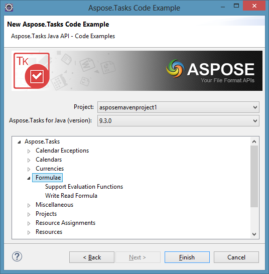

## **Installing**
**Aspose.Tasks Java (Maven) for Eclipse** plugin can be easily installed from the Available **Plugin** tab in the Plugin dialog.

- To open it, select **Plugins** from the **Tools** menu in Eclipse.

- This adds the **Aspose.Tasks Maven Project** in New Project wizard and **Aspose.Tasks Code Example** in New File wizard of Eclipse IDE.

## **Using**

### **Aspose.Tasks Maven Project (wizard)**
To create **Maven Project** by wizard for using [Aspose.Tasks for Java API](https://products.aspose.com/tasks/java):

1. Select **New Project**.
2. Select **Aspose.Tasks Maven Project** in the **Maven** category.
3. Click **Next**. 

1. Provide **Project Name, Location, GroupId, ArtifactId** and **Version** for your Maven Project and click **Finish.** 

1. This will retrieve the [Aspose.Tasks for Java](https://products.aspose.com/tasks/java) latest [Maven Dependency](http://maven.aspose.com/repository/ext-release-local/com/aspose/aspose-tasks/) reference from [Aspose Cloud Maven Repository](http://maven.aspose.com/artifactory/webapp/home.html?0) and configure it in **pom.xml**. If you have opted for **Also Download Code Examples,** downloading of the **Code Examples** will also begin from the [Aspose.Tasks for Java API Examples Repository. ](https://github.com/aspose-tasks/Aspose.Tasks-for-Java/tree/master/Examples)
2. The **Maven** project will be created on your **Eclipse IDE** on completion of the wizard.
3. The created **Maven Project** is configured to use **Aspose.Tasks for Java API** and ready to be enhanced as per your Project requirements.
   If you have opted to download [Code Examples](https://github.com/aspose-tasks/Aspose.Tasks-for-Java/tree/master/Examples), you can use **Aspose.Tasks Code Example (wizard)** for importing needed **Code Examples** of [Aspose.Tasks for Java](https://products.aspose.com/tasks/java) API into your project.

### **Aspose.Tasks Code Example (wizard)**
**Aspose.Tasks Code Example wizard** allows you to try out many samples provided for [Aspose.Tasks for Java](https://products.aspose.com/tasks/java) API.

{}

To be able to use **Aspose.Tasks Code Example wizard** comfortably: it is recommended to always select **Also Download Code Examples** while creating **Maven Project** on **Aspose.Tasks Maven Project Wizard**, 

{}

To use examples, just:

1. Click **New File** in **Eclipse**.
2. Choose your project and then select **Aspose.Tasks Code Example** in the **Java** category.
3. Click **Next**. 

1. Expand the tree to select **Code Example** category and click **Finish**. 

1. This will copy the selected category **Code Examples** Java files into the project under **com.aspose.tasks.examples** package. Also any required resources needed by the Code Examples will be copied into **src/main/resources** folder
2. Review the example code, compile and run.
3. You can now test other examples and start building your own application using [Aspose.Tasks for Java API](https://products.aspose.com/tasks/java)
