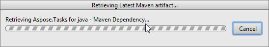
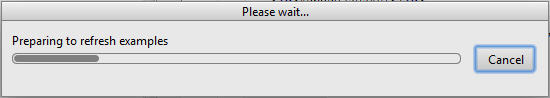

## **Installing**
### **How to Install Aspose.Tasks Java for IntelliJ IDEA (Maven)**
Steps below demonstrates how to install **Aspose.Tasks Java for IntelliJ IDEA (Maven)** plugin.

The  plugin is listed on IntelliJ IDEA’s CE [official plugin website](https://plugins.jetbrains.com/plugin/8003-aspose-tasks-java-for-intellij-idea-maven/) - plugin repository as **Aspose.Tasks Java for IntelliJ IDEA Maven**, so you don’t need to download it manually and install it from disk, but this extra option still exists in IntelliJ IDEA.

**Aspose.Tasks for Java for IntelliJ IDEA (Maven)** plugin can be easily installed (without manual downloading) from within IntelliJ IDEA. To do it:

1. Select **Settings** from the **File** menu.
2. Click **Plugins**, then browse the repositories in IntelliJ IDEA. 

### **Aspose.Tasks Maven Project Wizard**
Installing this plugin will introduce a new project type – 

**Aspose.Tasks Maven Project** – into IntelliJ IDEA, which will enable you to create Aspose.Tasks Maven based project for using [Aspose.Tasks for Java API. ](https://products.aspose.com/tasks/java). 

### **Aspose.Tasks Example Wizard**
An option for creating [Example Source Codes for using Aspose.Tasks for Java API](https://github.com/aspose-tasks/Aspose.Tasks-for-Java/tree/master/Examples) in the project, will also appear after the installation under "New" menu (using Right Click -> New **OR** File menu->New) – 

**Aspose.Tasks Example**

## **Using**
### **Aspose.Tasks Maven Project Wizard**
To create Aspose.Tasks Maven project for using [Aspose.Tasks for Java API](https://products.aspose.com/tasks/java) within IntelliJ IDEA, you need to have the internet connection. Then follow the steps below:

1. Select **New Project**.
2. Select **Aspose.Tasks Maven Project** 
3. Click **Next**. 

4. Provide a **GroupId, ArtifactId** and **Version** for your maven project and click **Next.**

5. You can select "Also Download Examples Source Code" checkbox to download the sample usage examples of the API (as shown in above snapshot)

6. Provide a **Project Name** and **Location** just like when creating any Java application

7. Click **Finish**.

This will retrieve the [Aspose.Tasks for Java API](https://products.aspose.com/tasks/java) latest maven dependency reference from Aspose Cloud Maven Repository and configure it in pom.xml
If you have selected "Also Download Examples Source Code" checkbox. Downloading of the examples will also begin from the [Aspose.Tasks for Java API GitHub Repository](https://github.com/aspose-tasks/Aspose.Tasks-for-Java/tree/master/Examples)

Congratulations! You have successfully created Aspose.Tasks Maven project for using [Aspose.Tasks for Java API](https://products.aspose.com/tasks/java).

The created Aspose.Tasks for Java API Maven project is ready to be modified as per your project’s requirements.

If you have opted to download [Example Source Codes](https://github.com/aspose-tasks/Aspose.Tasks-for-Java/tree/master/Examples), you can use Aspose.Tasks Examples wizard to copy / create the downloaded examples into your project.

## **Aspose.Tasks Examples Wizard**
To import/ copy [Example Source Codes ](https://github.com/aspose-tasks/Aspose.Tasks-for-Java/tree/master/Examples)into the project using **Aspose.Tasks Examples Wizard**, you need to first download the examples by opting  "Also Download Examples Source Code" on Aspose.Tasks Maven Project Wizard.

Then follow the steps below on IntelliJ IDEA:

1. Select **File** > **New -** As shown below: 

-OR- **Right Click** (on project window) => **New**  - As shown below: 

2. Select **Aspose.Tasks Example** Option from Menu - As shown below: 

  The wizard will refresh / check for the latest available [Aspose.Tasks for Java API Examples](https://github.com/aspose-tasks/Aspose.Tasks-for-Java/tree/master/Examples) 

3. **Aspose.Tasks Examples wizard** dialog will appear, where you can select any examples category to create / copy the examples into your project
Select any examples category and click **Create** : 

4. This will create / copy the selected category examples into the project under **com.aspose.tasks.examples** package.
Also any required resources for the execution of the examples will be copied to **src/main/resources** folder - As shown below:

Congratulations! You have successfully done the following:
1. You' have created Aspose.Tasks Maven Project using Aspose.Tasks Maven Project Wizard.
2. You have downloaded [Aspose.Tasks for Java API - Example Source Codes](https://github.com/aspose-tasks/Aspose.Tasks-for-Java/tree/master/Examples).
3. You have created / copied Examples Source Codes into your project by using Aspose.Tasks Example Wizard.
