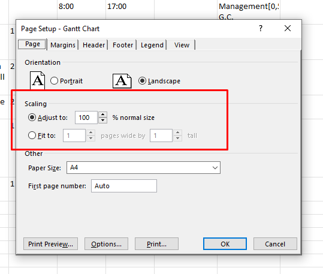

{}

This page contains release notes information for [Aspose.Tasks for Java 21.10](https://downloads.aspose.com/tasks/java/new-releases/aspose.tasks-for-java-21.10/).

{}
## **All Changes**
|**Key**|**Summary**|**Issue Type**|
| :- | :- | :- |
| TASKSJAVA-1539 | Implement printing support | New Feature |
| TASKSNET-4609 | Implement feature "Fit to X pages tall and Y pages wide" | New Feature |
| TASKSNET-10333 | Add support for scaling with given scale factor | New Feature |
| TASKSNET-10344 | Fix 'The start time should be not greater than the finish one' exception when creating project from Primavera .xer file | Bug
| TASKSNET-4757 | Fix invalid position of progress rectangle in task bars in Gantt chart | Bug
| TASKSJAVA-1534 | Problem reading extended attributes | Bug |

## **Public API and Backwards Incompatible Changes**

## **Examples and additional notes**

**Related issue: TASKSJAVA-1539 - Implement printing support**

Now Aspose.Tasks for Java can print document using printer installed in operation system. For changing printer settings,
set corresponding properties in PrinterSettings instance. There is also a new class PrintOptions, which is inherited
from SaveOptions and can be used for configuring document rendering.


Project project = new Project("example.mpp");

PrinterSettings printerSettings = new PrinterSettings() {{
    this.setPrinterName("Adobe PDF");
    this.setFromPage(2);
    this.setToPage(5);
}};

PrintOptions printOptions = new PrintOptions() {{
    this.setStartDate(new GregorianCalendar(2021, Calendar.OCTOBER, 16).getTime());
    this.setEndDate(new GregorianCalendar(2021, Calendar.DECEMBER, 31).getTime());
    this.setRenderToSinglePage(true);
}};

project.print(printerSettings, printOptions);


**Related issue: TASKSNET-10333 - Add support for scaling with given scale factor**

Now PageSettings.PercentOfNormalSize and PageSettings.AdjustToPercentOfNormalSize properties are taken into account when View is rendered.
These properties correspond to "Adjust to X % normal size" field of "Page Setup" dialog of MS Project:

Values of these properties are stored in MPP file and one can set values of these properties to render a view with a given scale factor:


Project project = new Project("Project.mpp");

View ganttChartView = project.getViews().stream()
        .filter(v -> v.getScreen() == ViewScreen.Gantt)
        .findFirst()
        .orElseThrow(IllegalStateException::new);
ganttChartView.getPageInfo().getPageSettings().setAdjustToPercentOfNormalSize(true);
ganttChartView.getPageInfo().getPageSettings().setPercentOfNormalSize(45);

PdfSaveOptions saveOptions = new PdfSaveOptions()
{{
    this.setStartDate(new GregorianCalendar(2021, Calendar.OCTOBER, 16).getTime());
    this.setEndDate(new GregorianCalendar(2021, Calendar.DECEMBER, 31).getTime());
    this.setViewSettings(ganttChartView);
    this.setTimescale(Timescale.DefinedInView);
}};

project.save("OutputScaledTo45.pdf", saveOptions);


**Related issue: TASKSNET-4609 - Implement feature "Fit to X pages tall and Y pages wide"**

Now PageSettings.PagesInWidth and PageSettings.PagesInHeight are taken into account when View is rendered.
These properties correspond to "Fit to X pages wide by Y tall" fields of "Page Setup" dialog of MS Project.
The properties can be used to fit the rendered view to the specified number of pages in width and height:


Project project = new Project("Project.mpp");

View taskUsageView = project.getViews().stream()
        .filter(v -> v.getScreen() == ViewScreen.TaskUsage)
        .findFirst()
        .orElseThrow(IllegalStateException::new);
taskUsageView.getPageInfo().getPageSettings().setAdjustToPercentOfNormalSize(false);
taskUsageView.getPageInfo().getPageSettings().setPagesInWidth(2);
taskUsageView.getPageInfo().getPageSettings().setPagesInHeight(2);

PdfSaveOptions saveOptions = new PdfSaveOptions()
{{
    this.setViewSettings(taskUsageView);
    this.setStartDate(new GregorianCalendar(2021, Calendar.OCTOBER, 16).getTime());
    this.setEndDate(new GregorianCalendar(2021, Calendar.DECEMBER, 31).getTime());
    this.setTimescale(Timescale.DefinedInView);
}};

project.save("OutputFitTo2х2.pdf", saveOptions);

