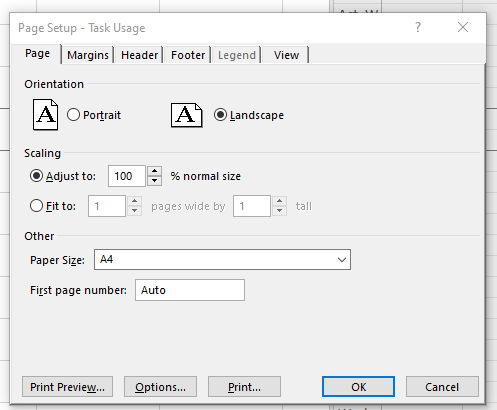
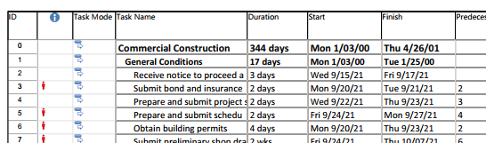
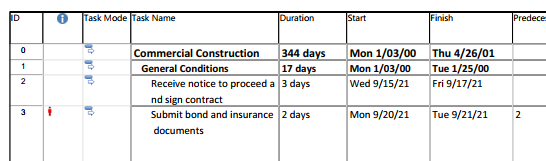

In this article we are going to describe options which are common for conversions of Microsoft Project MPP files to graphical formats (PDF, TIFF, PNG, SVG, HTML). 
Aspose.Tasks for .NET API can be used to convert project loaded from MS Project MPP, Primavera P6 XML, Primavera XER or other supported input formats to PDF or graphical formats. In this case a specific project's view is rendered in specified format.

## **Specifying a View to save**

Microsoft Project supports different view, such as 'Gantt Chart', 'Task Usage', 'Resource Usage', etc. Each view can be customized and these settings are stored in MPP file. Aspose.Tasks for .NET allows the user to examine and change these settings using [Project.Views](https://reference.aspose.com/tasks/net/aspose.tasks/project/properties/views) collection.

There are 3 ways to specify the View which will be exported when project is saved to graphical formats.

1. Do not specify a View explicitly.
In this case Project.DefaultView will be rendered. If default view is missing, Gantt Chart view will be rendered.
2. Use [SaveOptions.PresentationFormat](https://reference.aspose.com/tasks/net/aspose.tasks.saving/saveoptions/properties/presentationformat) to specify value of [PresentationFormat](https://reference.aspose.com/tasks/net/aspose.tasks.visualization/presentationformat) enumeration.
In this case the view with the correspondent Screen property will be selected from Project.Views collection. 
If View is missing, the default settings are used.
3. Use [SaveOptions.ViewSettings](https://reference.aspose.com/tasks/net/aspose.tasks.saving/saveoptions/properties/viewsettings) property to explicitly specify the View object to render. If View object is specified, the value of SaveOptions.PresentationFormat is ignored.

## **Specifying a page size**

When project is rendered, the rendering routine needs to know page size to fit view's elements properly.

Page size can be specified in the following ways:

1) Do not specify page size.
In this case PageSize.A4 will be used.
2) Specify predefined PageSize via SaveOptions.PageSize property:


Project project = new Project("Project.mpp");
PdfSaveOptions saveOptions = new PdfSaveOptions()
{
    PresentationFormat = PresentationFormat.GanttChart,
    PageSize = PageSize.A2
};

project.Save("OutputFitToA2.pdf", saveOptions);


3) Specify custom PageSize via SaveOptions.CustomPageSize property:


Project project = new Project("Project.mpp");
PdfSaveOptions saveOptions = new PdfSaveOptions()
{
    PresentationFormat = PresentationFormat.GanttChart,
    CustomPageSize = new SizeF(700, 900),
};

project.Save("OutputFitToCustomPage.pdf", saveOptions);


4) Specify PageSize.DefinedInView to use page size saved in MS Project's Page Setup dialog:

The option is applicable when input file is in MS Project MPP format


Project project = new Project("Project.mpp");

var taskUsageView= project.Views.FirstOrDefault(v => v.Screen == ViewScreen.TaskUsage);
taskUsageView.PageInfo.PageSettings.PaperSize = PrinterPaperSize.PaperEnvelope10;

PdfSaveOptions saveOptions = new PdfSaveOptions()
{
    ViewSettings = taskUsageView,
    PageSize = PageSize.DefinedInView
};

project.Save("OutputToEnvelope.pdf", saveOptions);


## **Fitting Contents to Cell Size**
Commonly, a task (or resource) name is so long that it is truncated when project views are rendered. Aspose.Tasks for .NET provides the FitContent property in the SaveOptions class to avoid truncation of task and resource names. The code example below renders a project to PDF format with the FitContent property set to true.



Here is an examples of an output file without and with FitContent option:

 

## **Printing or Hiding Legends when Rendering**

To let you print or hide the legends on each page, the SaveOptions class provides the LegendOnEachPage property. If this flag is set to true, legends are printed on each page in the output file.



## **Saving to Multiple PDF or graphical files**
To save project data to multiple PDF files, set the SaveToSeparateFiles flag to true.

