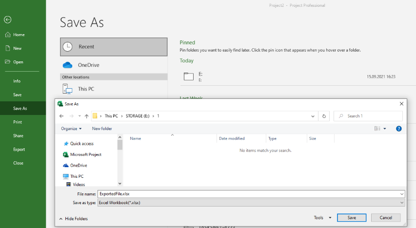
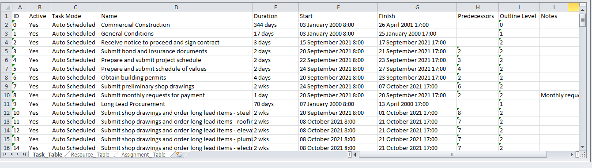

Microsoft Project allows the user to export project's data to formats supported by Microsoft Excel such as ([Spreadsheet2003 XML](https://en.wikipedia.org/wiki/SpreadsheetML) or [XLSX](https://docs.fileformat.com/spreadsheet/xlsx/) format).

These are steps to export project data to Excel formats:

Suppose you have your project opened in Microsoft Project.

1) Select "File\Save As" menu item
2) Select location (e.g. "This PC")
3) In "Save As" dialog select 'Excel Workbook(*.xlsx)' or 'Excel 97-2003 Workbook (*.xls)' format in "Save as type" drop down.
3) Click "Save" button
4) In Export Wizard select either "Project Excel Template" to apply default settings or "Selected Data" to customize the output.

If default settings are applied the output Excel Workbook will look as follows:

You can export Microsoft Project MPP file to Microsoft Excel spreadsheet file formats ([Spreadsheet2003 XML](https://en.wikipedia.org/wiki/SpreadsheetML) or [XLSX](https://docs.fileformat.com/spreadsheet/xlsx/) programmatically using Aspose.Tasks for .NET API. In this case you don't need to have Microsoft Project installed on your machine. 

## **Convert MS Project MPP files to Spreadsheet2003 XML (Excel 2003)**
There are two ways to convert projects to [Spreadsheet2003 XML](https://en.wikipedia.org/wiki/SpreadsheetML) format. The first one is to use [SaveFileFormat](https://apireference.aspose.com/tasks/net/aspose.tasks.saving/savefileformat) enumeration. The second one is to use [Spreadsheet2003SaveOptions](https://apireference.aspose.com/tasks/net/aspose.tasks.saving/spreadsheet2003saveoptions) class.

In order to convert a MS Project MPP file to Spreadsheet2003 XML format with default settings using [SaveFileFormat](https://apireference.aspose.com/tasks/net/aspose.tasks.saving/savefileformat):

1. Create a new project instance and load the MPP file.
2. Convert the project to Spreadsheet2003 XML using [Project.Save](https://apireference.aspose.com/tasks/net/aspose.tasks.project/save/methods/1) method and specify the SaveFileFormat.Spreadsheet2003 as the argument.

The following lines of code show how to achieve this in .NET:



To convert MPP files with a non-default settings the [Spreadsheet2003SaveOptions](https://apireference.aspose.com/tasks/net/aspose.tasks.saving/spreadsheet2003saveoptions) class can be used. With this class one can specify additional options to customize the resulting Spreadsheet2003 XML.

1. Create a new project instance and load the MPP file.
2. Create an instance of [Spreadsheet2003SaveOptions](https://apireference.aspose.com/tasks/net/aspose.tasks.saving/spreadsheet2003saveoptions).
3. Customize view using properties of Spreadsheet2003SaveOptions class.
4. Convert the project to Excel using [Project.Save](https://apireference.aspose.com/tasks/net/aspose.tasks.project/save/methods/2) method and pass the Spreadsheet2003SaveOptions instance as the argument.

Presented below is .NET example showing how to use the convert options:



## **Convert MS Project MPP files to Excel XSLX (Excel 2007 and later)**

The [Project](https://apireference.aspose.com/tasks/net/aspose.tasks/project/) class exposes the Save method which is used to save a project in various formats. The [Project.Save](https://apireference.aspose.com/tasks/net/aspose.tasks.project/save/methods/1) method allows you to export project tasks, resources and assignments to separate worksheets to Microsoft Excel [XLSX](https://docs.fileformat.com/spreadsheet/xlsx/) format using the [SaveFileFormat](https://apireference.aspose.com/tasks/net/aspose.tasks.saving/savefileformat) enumeration type or the [XlsxOptions](https://apireference.aspose.com/tasks/net/aspose.tasks.saving/xlsxoptions) class.

In order to convert MS Project MPP file to XLSX format with default settings using [SaveFileFormat](https://apireference.aspose.com/tasks/net/aspose.tasks.saving/savefileformat):

1. Create a new project instance and load the MPP file.
2. Convert the project to Excel XLSX using Project.Save method and specify the SaveFileFormat.XLSX as the argument.

The following lines of code show how to achieve this in .NET:



To convert MPP files with a non-default settings the [XlsxOptions](https://apireference.aspose.com/tasks/net/aspose.tasks.saving/xlsxoptions) class is provided. With this class one can specify additional options to customize the resulting XLSX file.

1. Create a new project instance and load the MPP file.
2. Create an instance of [XlsxOptions](https://apireference.aspose.com/tasks/net/aspose.tasks.saving/xlsxoptions).
3. Customize view using properties of XlsxOptions class.
4. Convert the project to Excel using Project.Save method and pass the XlsxOptions instance as the argument.

Presented below is .NET example showing how to use the options:



## **Converting MS Project MPP file as CSV**
In order to learn how to export MS Project MPP file to CSV please read [the article](/tasks/net/convert-mpp-to-csv).
