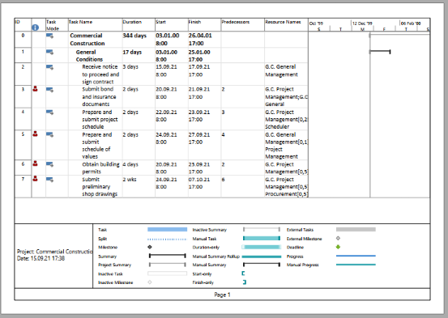

Microsoft Project allows the user to export project's data to [PDF](https://en.wikipedia.org/wiki/PDF) format.

These are steps to export project data to Excel formats:

Suppose you have your project opened in Microsoft Project.

1) Select "File\Save As" menu item
2) Select location (e.g. "This PC")
3) In "Save As" dialog select 'PDF Files(*.pdf) format in "Save as type" drop down.
3) Click "Save" button
4) In Document Export Options dialog select Publish Range, and click "OK".

The currently selected View will be rendered to PDF file. Here is an example of the output file:

Aspose.Tasks for .NET also provides the capability to render project's view in PDF format programmatically. In this case you don't need to have Microsoft Project installed on your machine. This article gives a detailed overview of the variety of options available in Aspose.Tasks for exporting projects to PDF.

## **Saving a Project as a PDF**
The [Project](https://apireference.aspose.com/tasks/net/aspose.tasks/project) class exposes the Save method which is used to save a project in various formats. The [Save](https://apireference.aspose.com/tasks/net/aspose.tasks.project/save/methods/3) method allows you to render project data to PDF using the [SaveFileFormat](https://apireference.aspose.com/tasks/net/aspose.tasks.saving/savefileformat) enumeration type.

To save a project to PDF:

1. Load a Microsoft Project file.
2. Optionally make changes to the loaded project.
3. Save the project to PDF one of Project.Save method overloads.
Your can use either SaveFileFormat.PDF to save project with default settings or PdfSaveOptions to customize export options.

- Please note that you cannot set values against the **Application** and **Producer** fields, because of Aspose Ltd. and Aspose.Tasks for .NET x.x.x will be displayed against these fields.

The following lines of code demonstrate how to achieve this using C#.



## **Specifying a View to save to PDF**

Microsoft Project supports different view such as 'Gantt Chart', 'Task Usage', 'Resource Usage', etc. Each view can be customized and these settings are stored in MPP file. Aspose.Tasks for .NET allows the user to examine and change these settings using [Project.Views](https://apireference.aspose.com/tasks/net/aspose.tasks/project/properties/views) collection.

There are 3 ways to specify the View which will be exported to PDF:

1. Do not specify a View explicitly.
In this case Project.DefaultView will be rendered. If default view is missing, Gantt Chart view will be rendered.
2. Use [SaveOptions.PresentationFormat](https://apireference.aspose.com/tasks/net/aspose.tasks.saving/saveoptions/properties/presentationformat) to specify value of [PresentationFormat](https://apireference.aspose.com/tasks/net/aspose.tasks.visualization/presentationformat) enumeration.
In this case the view with the correspondent Screen property will be selected from Project.Views collection. 
If View is missing, the default settings are used.
3. Use [SaveOptions.ViewSettings](https://apireference.aspose.com/tasks/net/aspose.tasks.saving/saveoptions/properties/viewsettings) property to explicitly specify the View object to render. If View object is specified, the value of SaveOptions.PresentationFormat is ignored.

## **Fitting Contents to Cell Size**
Commonly, a task (or resource) name is so long that it is truncated when project views are rendered. Aspose.Tasks for .NET provides the FitContent property in the SaveOptions class to avoid truncation of task and resource names. The code example below renders a project to PDF format with the FitContent property set to true.



## **Printing or Hiding Legends when Rendering**
To let you print or hide the legends on each page, the SaveOptions class provides the LegendOnEachPage property. If this flag is set to true, legends are printed on each page in the output file.



## **Supported Graphical Column Indicators**
Aspose.Tasks draws graphical column indicators when rendering project data to output PDF. The following graphical indicators are supported by Aspose.Tasks:

|**Indicator Type**|**Graphical Indicator**|
| :- | :- |
|Task Indicators||
|Resource Indicators||
|Assignment Indicators||

## **Saving to Multiple PDF Files**
To save project data to multiple PDF files, set the SaveToSeparateFiles flag to true.



## **Customizing TextStyle for Project Data**
Aspose.Tasks for .NET API allows developers to customize the text style for over-allocated resources. By default, the style used for overallocated resources is similar to Microsoft Project (MSP), that is, red and bold. TextItemType.OverallocatedResources makes it possible to customize the color and style for the overallocated resources.



## **Customizing Date Formats**
Aspose.Tasks for .NET API allows developers to customize the date format using the DateFormat enumerator when rendering project data.



## **Setting Default Font**
Setting default font during rending of documents helps when a font is not found. In such a case, the default font replaces the missing font and output is not affected. Aspose.Tasks for .NET API lets you specify the default font using the DefaultFontName property of the PdfSaveOptions as shown in the following code sample.


