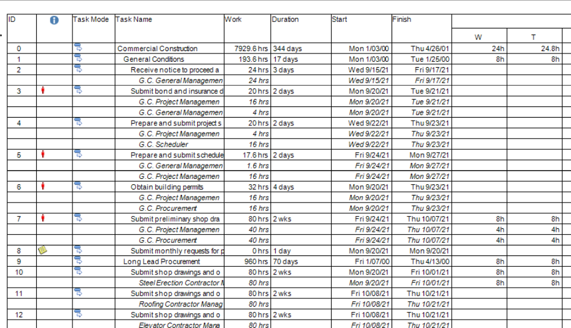

## **Exporting Project Data to TIFF**

TIFF or Tag Image File Format is a computer file format for storing raster graphics images.
Aspose.Tasks for .NET API lets you save Project's view to TIFF file format.

Here is an example of the output TIFF file: 

To save a project to TIFF programmatically using Aspose.Tasks for .NET:

1. Load a Microsoft Project MPP file.
2. Optionally make changes to the loaded project.
3. Save the project to TIFF using one of Project.Save method overloads.
Your can pass either SaveFileFormat.TIFF to save project with default settings or pass ImageSaveOptions to customize export options.

The following [article](/tasks/net/common-conversions-options/) describes properties common for all graphical formats.

Also additional options specific to TIFF format can specified. ImageSaveOptions.PixelFormat can be used to set the format of the color data for each pixel in the image. For example, Format24bppRgb specifies that the format is 24 bits per pixel; 8 bits each are used for the red, green, and blue components.

The horizontal and vertical resolution in dpi can be controlled using [ImageSaveOptions.HorizontalResolution](https://reference.aspose.com/tasks/net/aspose.tasks.saving/imagesaveoptions/properties/horizontalresolution) and [ImageSaveOptions.VerticalResolution](https://reference.aspose.com/tasks/net/aspose.tasks.saving/imagesaveoptions/properties/verticalresolution).
[ImageSaveOptions.TiffCompression](https://reference.aspose.com/tasks/net/aspose.tasks.saving/imagesaveoptions/properties/tiffcompression) can be used to specify the type of compression algorithm used when generating TIFF file.

The code example given below demonstrates how to export your project data from MPP file to TIFF.
