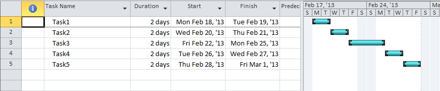
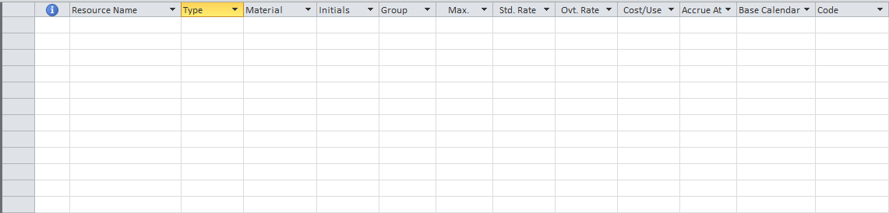
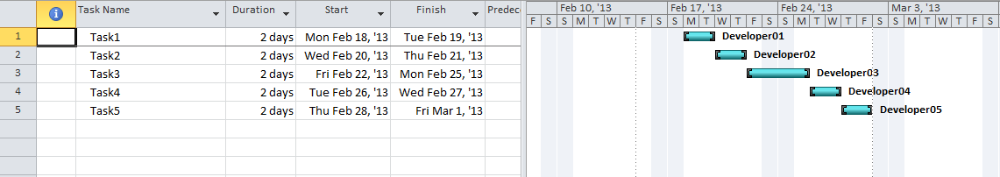
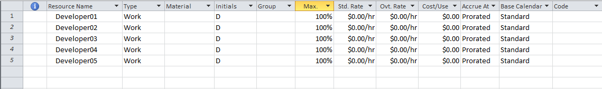

{} 

While working with MPP files, you might need to create resources and link them to tasks from your project. This article gives an idea about how to load MPP files in your .NET applications and create resources and link to tasks from your projects using [VSTO](/tasks/net/create-resources-and-link-with-tasks-html/) and [Aspose.Tasks for .NET](/tasks/net/create-resources-and-link-with-tasks-html/).

{} 
## **Create Resources and Link them to Tasks using VSTO**
The following steps are required to accomplish this task:

1. Create a new project in Visual Studio.
1. In the Solution Explorer, right-click and select **Add Reference**, then select the **COM components** tab.
1. Select Microsoft Project 12.0 Object Library and click **OK**. 
   This imports the Microsoft.Office.Interop.MSProject namespace at the start of the code.
1. Use the code from the following example to read tasks and resources.
### **Code Examples - VSTO**
The sample project file used in the following code snippets, SampleProject.mpp, can be downloaded from this page attachments. Before resources are created and and linked them to tasks, the Project1.mpp file looks as below.

**Input file: Gantt chart view** 

**Input file: Resource sheet view** 

After processing, the file is updated.

**Output file: Gantt chart view** 

**Output file: Resource sheet view** 



// Create an Application object

Microsoft.Office.Interop.MSProject.Application projectApplication = new Application();

object missingValue = System.Reflection.Missing.Value;

// Open an MPP file

projectApplication.FileOpenEx(@"SampleProject.mpp",

    missingValue, missingValue, missingValue, missingValue,

    missingValue, missingValue, missingValue, missingValue,

    missingValue, missingValue, PjPoolOpen.pjPoolReadOnly,

    missingValue, missingValue, missingValue, missingValue,

    missingValue);

Microsoft.Office.Interop.MSProject.Project project = projectApplication.ActiveProject;

int iRecourceId = 1;

foreach (Task tsk in project.Tasks)

{

    string developer = "Developer0" + iRecourceId;

    project.Resources.Add(developer, iRecourceId);

    tsk.Assignments.Add(tsk.ID, iRecourceId, missingValue);

    iRecourceId++;

}

projectApplication.FileCloseAll(Microsoft.Office.Interop.MSProject.PjSaveType.pjSave);


## **Create Resources and Link to Tasks using Aspose.Tasks for .NET**
The following steps are required to accomplish this task:

1. Create a new project in Visual Studio.
1. In the Solution Explorer, right-click and select **Add Reference**, then select the **.NET** tab.
1. Select **Aspose.Tasks** and then click **OK**. 
   This imports the Aspose.Tasks namespace at the start of the code.
1. Use the code from the following example to create resources and link them to tasks.
### **Code Examples - Aspose.Tasks**


