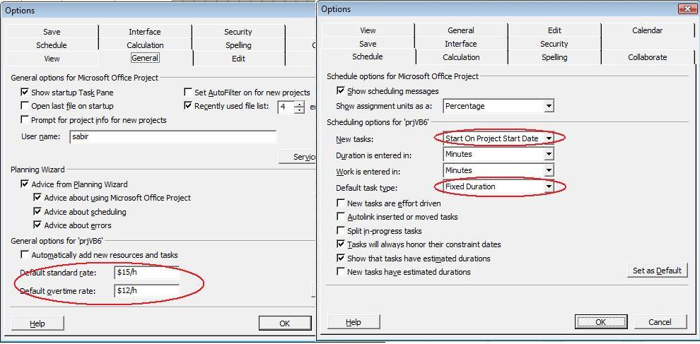

This is an ASP classic page with VB Script that gathers information about default standard and overtime rates for a project from the user and saves the project file in XML format.


<%@ LANGUAGE = VBScript %>
<% Option Explicit %>
<html>
  <head>
    <title>Aspose.Tasks classical ASP sample</title>
  </head>
  <body>
    <h3>Aspose.Tasks classical ASP sample</h3>
    <form name=Form1 method=Post action="sample.asp">
      
Please enter Default Standard and Overtime Rate:

      
Standard Rate: <input type=Text name=stdRate>

      
Overtime Rate: <input type=Text name=otimeRate>

      <input type=Submit value="Generate Project File">
    </form>
    <%
      If Request.form("stdRate") <> "" AND Request.form("otimeRate") <>  "" Then
        'Create a Project
        Dim prj
        Set prj = CreateObject("Aspose.Tasks.Project")
        'Create a Project Writer
        Dim prjWriter
        Set prjWriter = CreateObject("Aspose.Tasks.ProjectWriter")
        prj.DefaultStandardRate = Request.form("stdRate")
        prj.DefaultOvertimeRate = Request.form("otimeRate")
        prjWriter.Write prj,"prjASP.xml", Aspose_Tasks.TasksDataFormat.TasksDataFormat_XML        
        Response.Write("Project file created in XML format")
    %>
  </body>
</html>


Presented below are default properties of standard/overtime resource rates of the created XML project file:

