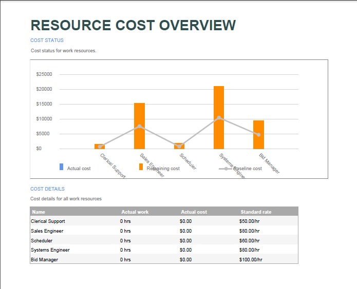
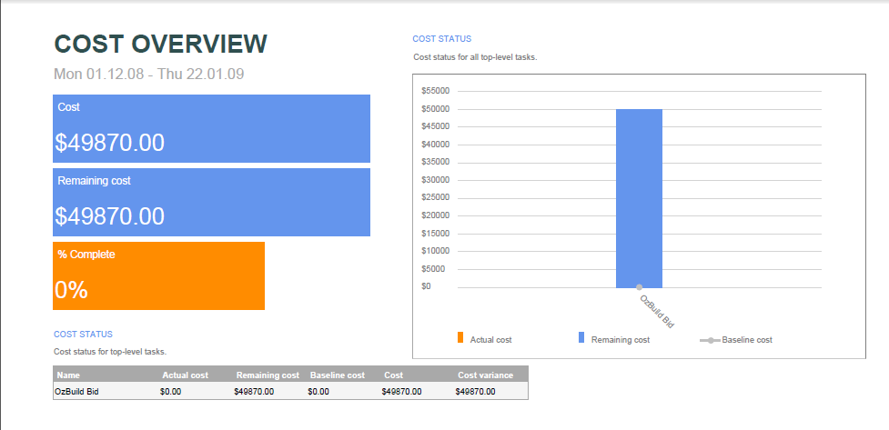
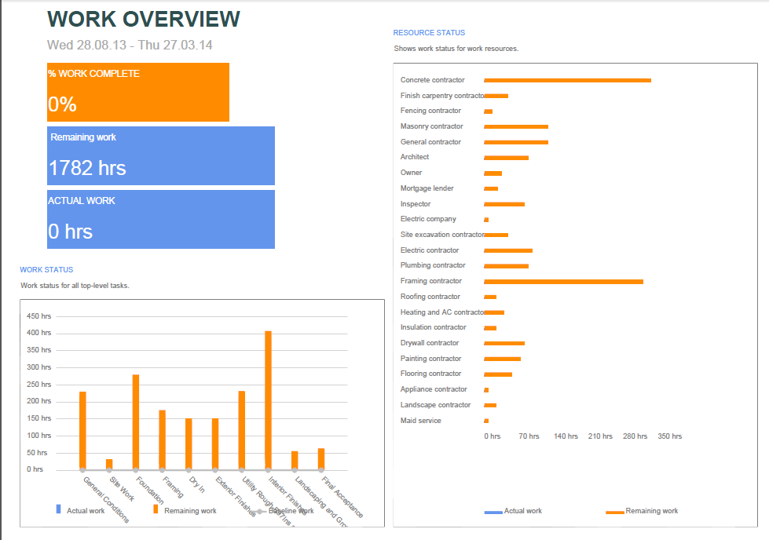
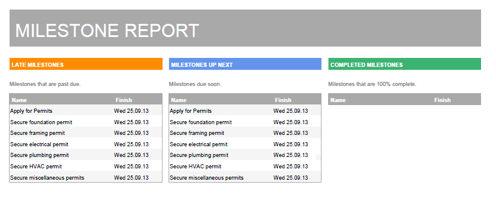
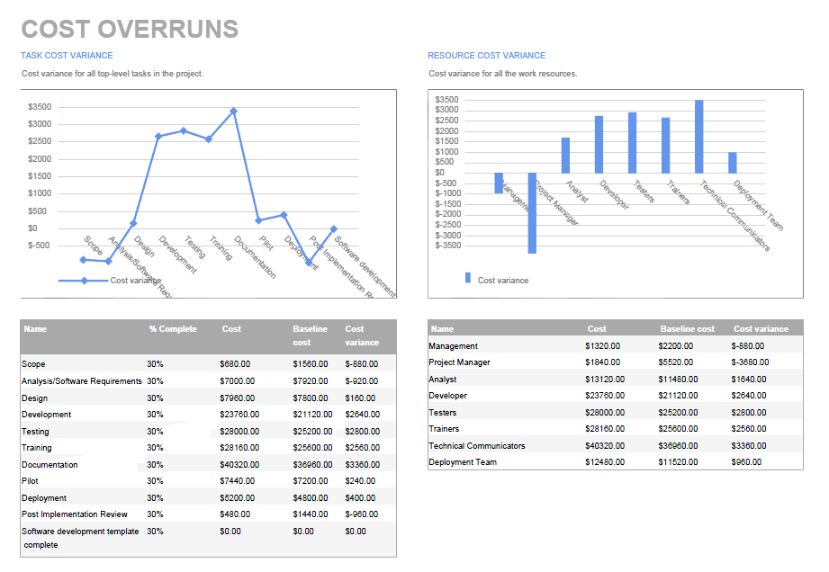
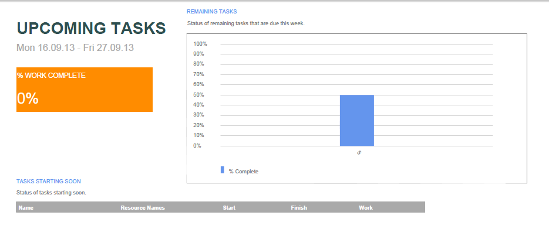
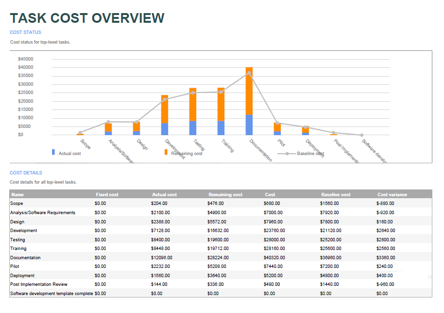
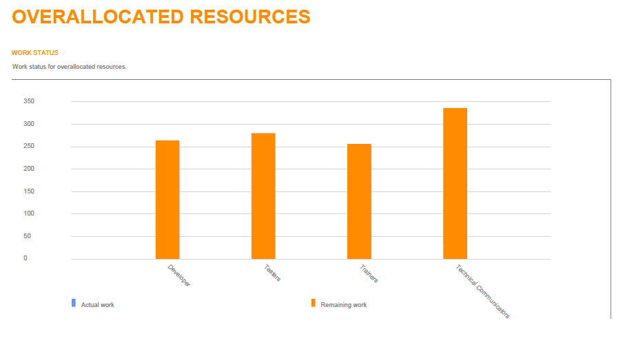
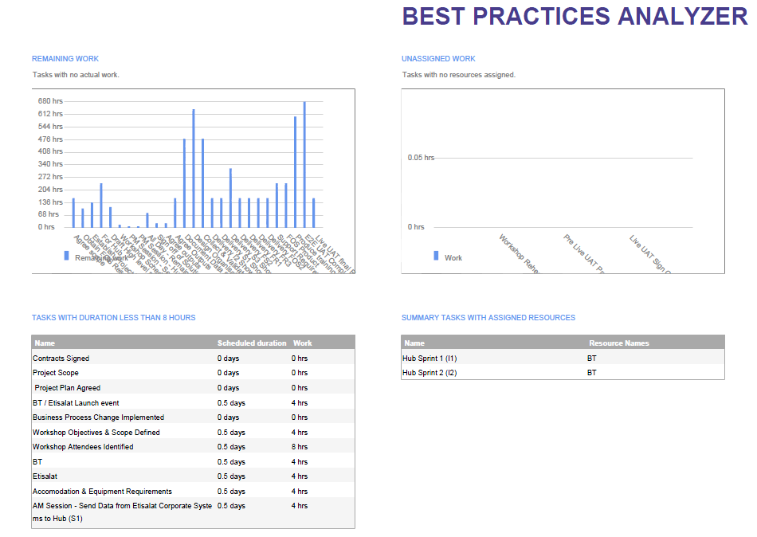
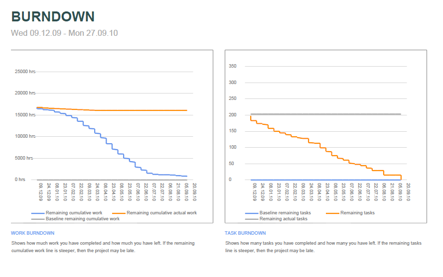

{} 

Aspose.Tasks for .NET provides reporting services for creating reports from project files similar to Microsoft Project. The SaveReport function is used to create PDF files containing the report's images. This function takes two arguments:

1. the PDF file name, and
2. the ReportType enumerator.

{}

## **Aspose.Tasks Reporting Services**
### **Types of Report**
The following types of reports can be created using Aspose.Tasks:

1. Project overview
2. Resource cost overview
3. Cost overview
4. Work overview
5. Critical tasks
6. Milestones
7. Late tasks
8. Resource overview
9. Cost overruns
10. Upcoming task
11. Task cost overview
12. Over-allocated resources
13. Slipping tasks
14. Best practice analyzer
15. Burn down
16. Cash flow

The sample code snippets below can be used to create these reports. All the sample MPP files used in these examples are present as attachments for testing the sample code.

#### **Project Overview**



#### **Resource Cost Overview**



#### **Cost Overview**



#### **Work Overview**



#### **Critical Tasks**



#### **Milestones**



#### **Late Tasks**



#### **Resource Overview**



#### **Cost Overruns**



#### **Upcoming Task**



#### **Task Cost Overview**



#### **Over-allocated Resources**



#### **Slipping Tasks**



#### **Best Practice Analyzer**



#### **Burn Down**



#### **Cash Flow**


