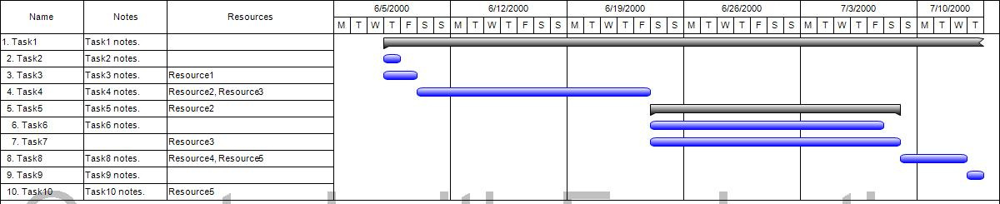

## **Overview**
In Microsoft Project, project data is not only available in the textual form, but can also be displayed graphically as a chart. The most popular chart types are Gantt Chart, Task Usage and Resource Usage. Aspose.Tasks for .NET supports rendering of project data to a chart.

This article describes two approaches which allows to customize project columns to be included in a Gantt chart and demonstrates how to render the chart to an image.

## **Gantt Chart**
A Gantt chart is a graphical representation of project tasks broken down by days, weeks or months. A project is composed of tasks assigned to different resources. An individual task may be divided into sub-tasks as part of tasks management. Every task has a start date and end date that determines its duration. A Gantt chart in Microsoft Project gives a quick view of such project data. This screenshot shows a typical Gantt chart in Microsoft Project:

## **Gantt Chart Image in Aspose.Tasks for .NET**
In Aspose.Tasks for .NET, the Project class is the main class for handling project files. The Project class exposes different overloads if "Save" method for exporting project data to different file formats. 
The users can configure this method to export project data to any supported format by passing parameters.

For instance, consider Save(string, SaveOptions) overload.

- The first parameter is the destination file name.
- The second and most important parameter accepts one of inheritors of SaveOptions class. For example, for PDF format one can pass PdfSaveOptions.

### **SaveOptions Type**
The rendering behavior can be customized using properties of SaveOptions class (or one of its inheritors).
For example, page size of output document can be set using SaveOptions.CustomPageSize property or SaveOptions.LegendOnEachPage can be set to define whether a legend should be displayed on each page.


PdfSaveOptions saveOptions = new PdfSaveOptions()
{
   CustomPageSize = new SizeF(800, 600),
   LegendOnEachPage = false
};


There are at least two approaches to customize appearance of the rendered chart.

### **Customize Gantt Chart columns using ProjectView Type**

Please note that it's an obsolete way to customize appearance and it's less likely that it will be extended or improved in future.
The ProjectView class has limited functionality and can be used to display specific columns in the output image. A constructor of this class takes an array list of the GanttChartColumn class as its argument.
The resulting ProjectView instance should be set as a value of SaveOptions.View property.
The example code shows how it works:


//Create the view columns
var columns = new List<GanttChartColumn>();
columns.Add(new GanttChartColumn("Name", 100, new TaskToColumnTextConverter(TaskName)));
columns.Add(new GanttChartColumn("Notes", 100, new TaskToColumnTextConverter(TaskNotes)));
columns.Add(new GanttChartColumn("Resources", 200, new TaskToColumnTextConverter(TaskResources)));
//Create the view
ProjectView projectView = new ProjectView(columns);

// Create SaveOptions
PdfSaveOptions saveOptions = new PdfSaveOptions()
{
   CustomPageSize = new SizeF(800, 600),
   View = projectView
};

// Save the project to PDF.
project.Save("output.pdf", saveOptions);



The constructor of the GanttChartColumn class takes three arguments - the column name, width and a delegate TaskToColumnTextConverter - to convert task data to column text.

In the above code example, TaskToColumnTextConverter delegate calls three target methods, TaskName, TaskNotes and TaskResources, to convert the data in these columns to text. The three methods are implemented in the following code example.


/// 

/// Converts a task's name data to column text.
/// 

/// <param name="task">Current task.</param>
/// <returns>Column's text.</returns>
private string TaskName(Task task)
{
    StringBuilder res = new StringBuilder();
    for (int i = 1; i < task.OutlineLevel; i++)
    {
        res.Append("  ");
    }

    res.AppendFormat("{0}. {1}", task.Id, task.Name);
    return res.ToString();
}

/// 

/// Converts a task's name data to column text.
/// 

/// <param name="task">Current task.</param>
/// <returns>Column's text.</returns>
private string TaskNameHtml(Task task)
{
    StringBuilder res = new StringBuilder();
    for (int i = 1; i < task.OutlineLevel; i++)
    {
        res.Append("&nbsp;&nbsp;");
    }

    res.AppendFormat("{0}. {1}", task.Id, task.Name);
    return res.ToString();
}

/// 

/// Converts a task's notes data to column text.
/// 

/// <param name="task">Current task.</param>
/// <returns>Column's text.</returns>
private string TaskNotes(Task task)
{
    if (task.NotesText != null)
        return task.NotesText;
    else
        return string.Empty;
}

/// 

/// Converts a task's resources data to column text.
/// 

/// <param name="task">Current task.</param>
/// <returns>Column's text.</returns>
private string TaskResources(Task task)
{
    StringBuilder res = new StringBuilder();
    Project project = task.ParentProject;
    bool bFirst = true;
    foreach (ResourceAssignment assignment in project.GetResourceAssignmentsByTask(task))
    {
        if (assignment.Resource != null)
        {
            if (!bFirst)
            {
                res.Append(", ");
            }
 
            res.Append(assignment.Resource.Name);
            bFirst = false;
        }
    }

    return res.ToString();
}


The following is the image and HTML image produced with the example code:

### **Customize Gantt Chart columns using View type**

Usage View class and its inheritors is a recommended way to customize charts when rendering project data.
View class corresponds to view settings used in MS Project (which are stored in MPP file) and provided richer API compared to ProjectView's API.
Available properties of View class can be found in [API Reference](https://apireference.aspose.com/tasks/net/aspose.tasks/view).
The existing View can be taken (for projects loaded from MPP file with views saved by Microsoft Project), customized and passed to Project.Save method as demonstrated in the following code snippet:


Project project = new Project("input.mpp"));

// Get existing view.
var view = (GanttChartView) project.Views.GetByName("&Gantt Chart");

// Define and insert new column to the view.
TableField field = new TableField()
{
    AlignData = StringAlignment.Far,
    Width = 50,
    Field = Field.TaskName,
    Title = "Task name"
};

view.Table.TableFields.Insert(1, field);
PdfSaveOptions saveOptions = new PdfSaveOptions()
{
    ViewSettings = view
};

project.Save("output.pdf", saveOptions);
