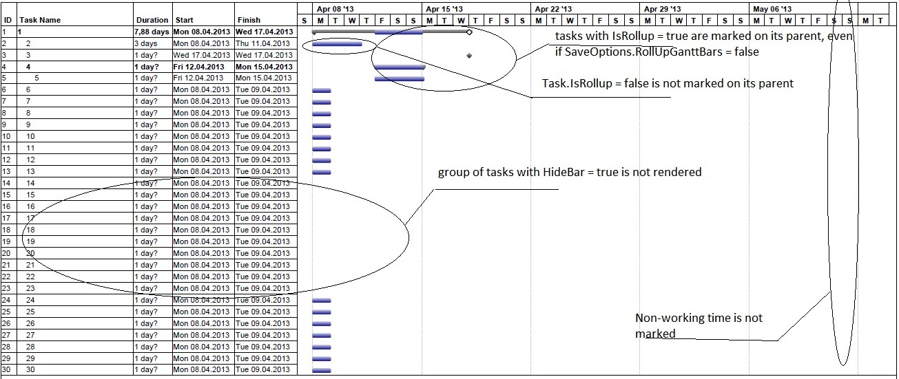

{} 

Microsoft Project lets users set the timescale that a Gantt chart is displayed in. (The timescale is indicated at the top of the Gantt chart view.) They can have up to three tiers of timescale to give them exactly the time resolution they need.

Aspose.Tasks supports this feature and lets you render Gantt charts with different timescale settings. Gantt charts can be rendered to one-page image using these options.

{} 
## **Setting Timescales and Saving to an Image**
The [ImageSaveOptions]() class's Timescale property determines a project's timescale settings. The timescale is set to Days by default. The other options are Month and Third of Months.

The following code sample:

1. Reads a project file.
2. Sets each different timescale setting.
3. Saves the file to disk as a JPG.



## **Rolling Up Gantt Bars During Rendering**
- If the SaveOptions.RollUpGanttBars property is set to true, any summary task in the project is marked by its visible subtasks, keeping into account the Task.HideBar property when rendering. (If Task.HideBar = true, the bar is not rendered on the Gantt chart.)
- If SaveOptions.RollUpGanttBars = false, the subtask will be shown on the summary task anyway, provided that subtask.IsRollup and subtask.ParentTask.IsRollup are set to true.

Also, if SaveOptions.DrawNonWorkingTime (default value = true) is set to false, non-working time will not be shown on the Gantt chart.
### **Example 1: Gantt Chart Bars Not Rolled Up**


**The output from example 1** 

### **Example 2: Rolling Up Gantt Chart Bars**
In this example, SaveOptions.RollUpGanttBars = true, SaveOptions.DrawNonWorkingTime = true, and task.HideBar = false for hidden tasks.



**The output from example 2** 

## **Customize Text with Task Bars**
In this example, the text on the right of the taskbar can be customized by delegate instance. Here we customize the text on the critical tasks.



## **Align Cell Contents**
Text can be aligned by GanttChartColumn.StringAlignment, ResourceViewColumn.StringAlignment properties. Alignment by default is StringAlignment.Near (left).



## **Changing Gantt Chart Bars Color Gradient**
Microsoft Project allows users to render the output of Gantt charts using gradients. The same functionality is provided by Aspose.Tasks as shown in the following sample code.


## **Setting Start date of Gantt Chart View**
The TimeScaleStart property exposed by Prj class allows to set the start date of the Gantt chart view. However, if the saved file is opened by MSP in maximized window mode then the timescale start date will not match.


