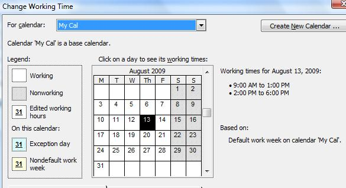

## **Creating a Calendar**
Calendars and other information is used by Microsoft Project to build project schedules. With Aspose.Tasks for .NET, adding a calendar to a project is easy. The Calendar class constructors allow you to assign an ID or a calendar name to the calendar, or use the default constructor. The options are described below.

There are three ways of creating a calendar in Aspose.Tasks. The [Calendar](https://apireference.aspose.com/tasks/net/aspose.tasks/calendar) class exposes the following three constructors:

- Calendar() – Default constructor.
- Calendar(int id) – Creates a calendar with an ID.
- Calendar(string name) – Creates a calendar with a name.

The following code creates three different calendars, one using each constructor.
Open the output file in Microsoft Project and, on the **Project** menu, select **Project Information** to access the calendars. 

**Project information showing the calendars**



## **Defining Weekdays for Calendar**
Microsoft Project keeps track of which days are considered weekdays in a calendar so that it can calculate project end dates and so on. Aspose.Tasks allows developers to define weekdays for a calendar associated with a project.

The Days collection exposed by the [Calendar](https://apireference.aspose.com/tasks/net/aspose.tasks/calendar) class is used to define the weekdays for a calendar. The Days collection represents an array list of [WeekDay](https://apireference.aspose.com/tasks/net/aspose.tasks/workingtime) objects.

The CreateDefaultWorkingDay method exposed by the WeekDay class can further be implemented to define the default day timings, while the FromTime and ToTime properties exposed by the [WorkingTime](https://apireference.aspose.com/tasks/net/aspose.tasks/workingtime) class is used to define the specific timing for a day. FromTime and ToTime support the DateTime data type.

The code samples below set weekdays for a project. After running the code, open the output file in Microsoft Project and, on the **Tools** menu, select **Change Work Timing** to establish that the changes have been applied. 

**Defining weekdays in Microsoft Project**

The code below defines Monday through Thursday as weekdays with default timings, whereas Friday as a weekday with special timings.



## **Replacing a Calendar with a New Calendar**
Calendars are used to see whether resources are available, and when tasks are scheduled. There are different types of calendars. This article looks at how to replace a base calendar, that is, the calendar used for projects and tasks, with another one.

Base calendars come in different forms:

- Standard: the default calendar has a Monday to Friday work week and a day that runs from 08:00 to 17:00.
- 24-hours: used for around the clock working, or for resources that run around the clock.
- Night shift: similar to the standard calendar, the night-shift calendar has a Monday to Saturday morning work week and a day that runs from 23:00 to 08:00.

The list of all calendars can be retrieved as [CalendarCollection](https://apireference.aspose.com/tasks/net/aspose.tasks/calendarcollection) using the [Project](https://apireference.aspose.com/tasks/net/aspose.tasks/project) class. The CalendarCollection can then be used to Remove or Add a new calendar as shown in the following code sample.

The following lines of code replace an existing calendar with a new standard calendar.



## **Making a Standard Calendar**
A standard calendar provides the most common work days, work hours and holidays. By default, a standard calendar is added whenever a project is created using Microsoft Project. Aspose.Tasks has features for defining a standard calendar for a project.

The [Calendar](https://apireference.aspose.com/tasks/net/aspose.tasks/calendar) class exposes the following two static (shared in Visual Basic) overloaded methods for creating a standard calendar:

- MakeStandardCalendar() – Creates a new standard calendar.
- MakeStandardCalendar(Calendar cal) – Makes a calendar as standard.

In Microsoft Project, open the file output by the code below and, on the **Tools** menu, select **Change Working Times Information**, to see the standard calendar. 

**The Change Working Times Information dialogue shows the standard calendar used by the project**

The following lines of code create a standard calendar using both methods.



## **Writing Updated Calendar Data to MPP**
With Aspose.Tasks for .NET, you can update calendar data in a Microsoft Project MPP file and save it back.

The following code shows how to update the calendar data of a project by adding a new calendar and saving it back to the original MPP file. The steps involved in this activity are:

1. Read the source MPP file.
2. Add the calendar data to the project.
3. Save the updated project data back to the MPP file.


