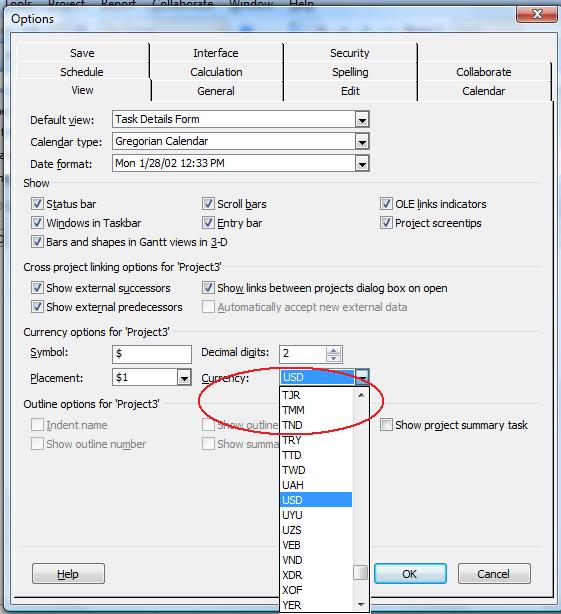

## **Managing Currency Codes**
The CurrencyCode property exposed by the [Project]() class is used to set or get the three-letter currency code for a project. This property supports the string data type.

To see a project's currency code in Microsoft Project:

1. On the **Tools** menu, select **Options**.
2. Select the **View** tab

**Currency codes in Microsoft Project** 

### **Setting Currency using Aspose.Tasks**
The following example shows how to set these properties.


### **Getting Currency Code using Aspose.Tasks**
These properties can be accessed using the project's CurrencyCode property.


