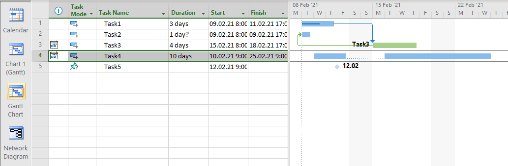

## **Reading Specific View's Data**
Views provides a graphical representation of a project or some of its aspects (resources, tasks, etc). For example, Gantt Charts provide a graphical representation of a project's progress and plans:

Microsoft Project allows the user to customize different view's properties such as the bar-style information, gridline properties, progress lines properties, time scale information, page properties, etc. All these properties are stored in MPP file. Aspose.Tasks for .NET provides the capability to access all the properties individually with the [View](https://apireference.aspose.com/tasks/net/aspose.tasks/view) class or its inheritors: [GanttChartView](https://apireference.aspose.com/tasks/net/aspose.tasks/ganttchartview), [TaskUsageView](https://apireference.aspose.com/tasks/net/aspose.tasks/taskusageview) or  [ResourceUsageView](https://apireference.aspose.com/tasks/net/aspose.tasks/resourceusageview) classes. This feature is supported for Microsoft Project 2003, 2007, 2010, 2013, 2016, 2019 and 2021 MPP file formats.



## **Configure Gantt Chart View by Showing Selected Custom Fields**
Extended attributes added to a project may be assigned to a task. It may be desirable to add this custom field to a saved MPP file's default view, or you might want selected custom fields to be shown automatically rather than selecting them manually. This article describes how to achieve this by customizing the Table of a Project.



## **Customizing Timescale Tier Labels according to Current Culture Information**
Aspose.Tasks for .NET API provides the capability to customize Timescale tier labels according to the current CultureInfo of the machine. The DateTimeConverter(DateTime date) delegate provides a converter method to convert date to a string in view timescale tiers. In addition, [TimescaleTier.DateTimeConverter](https://apireference.aspose.com/tasks/net/aspose.tasks.visualization/timescaletier) enables rendering of date in the desired format.



## **Customizing Timescale settings for a specific view and render a view using these settings**

The [TimeScaleTier](https://apireference.aspose.com/tasks/net/aspose.tasks.visualization/timescaletier) class makes it possible to set the Timescale settings for a view of a project. The below example shows how to achieve this objective using the Aspose.Tasks for .NET API



Project project = new Project();

// Retrieve project's Gantt chart view
GanttChartView view = (GanttChartView)project.Views.First(v => v.Name == "&Gantt Chart");

// Set Time Scale count
view.BottomTimescaleTier.Count = 2;
view.BottomTimescaleTier.ShowTicks = false; 
view.BottomTimescaleTier.Unit = TimescaleUnit.Days;
view.BottomTimescaleTier.Label = DateLabel.DayDdd;

view.MiddleTimescaleTier.Count = 1;
view.MiddleTimescaleTier.ShowTicks = false;
view.MiddleTimescaleTier.Unit = TimescaleUnit.Weeks;
view.MiddleTimescaleTier.Label = DateLabel.WeekDddDd;

// Add some test data to project
Task task1 = project.RootTask.Children.Add("Task 1");
Task task2 = project.RootTask.Children.Add("Task 2");
task1.Set(Tsk.Duration, task1.ParentProject.GetDuration(24, TimeUnitType.Hour));
task2.Set(Tsk.Duration, task1.ParentProject.GetDuration(40, TimeUnitType.Hour));

PdfSaveOptions saveOptions = new PdfSaveOptions();
saveOptions.ViewSettings = view;

// Timescale.DefinedInView options should be specified in order to render project using timescale settings 
// defined in view (in view.BottomTimescaleTier and view.MiddleTimescaleTier properties in this example).
// Otherwise predefined settings are used when one of Timescale.Days, Timescale.Months, Timescale.ThirdsOfMonths values is used.
saveOptions.Timescale = Timescale.DefinedInView;
project.Save("SetTimeScaleCount_out.pdf", saveOptions); 



## **Support for Text Styling**
Text styling can be applied to a Gantt Chart View using TableTextStyle as shown in the following code sample.



## **Save MPP using the specific Project's view**
The following code example demonstrates the ability to save the MPP to graphical format using the specific view from project's views.
The feature can be useful when several views were defined for the same View screen in MPP project.


Project project = new Project(Paths.TestdataPath + "TestViews.mpp");
var view = project.Views.First(v => v.Name == "Customized Resource &Sheet");
// We can set view's properties before use.
view.PageInfo.PageSettings.IsPortrait = false;
PdfSaveOptions saveOptions = new PdfSaveOptions();
saveOptions.ViewSettings = view;
project.Save("output.pdf", saveOptions);


## **Working with bar styles of Gantt chart view**
The following code example demonstrates how to modify task's bar styles for Gantt chart view.


Project project = new Project(Paths.TestdataPath + "TestGanttChartView.mpp");
var ganttChartView = (GanttChartView)project.Views.First(v => v.Name == "Gantt &Chart");
PdfSaveOptions saveOptions = new PdfSaveOptions();
saveOptions.Timescale = Timescale.DefinedInView;
saveOptions.ViewSettings = ganttChartView;

// Bar styles can be either task-specific (located in GanttChartView.CustomBarStyles)
// of category-specific (located in GanttChartView.BarStyles)

foreach (GanttBarStyle ganttBarStyle in ganttChartView.CustomBarStyles)
{
    if (ganttBarStyle.ShowForTaskUid != 11)
    {
        continue;
    }

    // For demonstration purposes we are modifying style for Task with Unique ID = 11
 
    ganttBarStyle.LeftField = Field.TaskName;
    // Here we set custom converter to control which text should be rendered inside the task bar.
    ganttBarStyle.InsideBarTextConverter = task => "Hours rem.: " + (int)task.Get(Tsk.RemainingWork).TimeSpan.TotalHours;
}

foreach (GanttBarStyle ganttBarStyle in ganttChartView.BarStyles)
{
    if (!ganttBarStyle.ShowForCategories.Contains(GanttBarShowFor.Milestone))
    {
        continue;
    }

    // For demonstration purposes we are modifying styles applicable to milestone tasks.

    ganttBarStyle.RightField = Field.TaskActualFinish;
    // Here we can customize text drawn at the top of task's bar using user provided delegate.
    ganttBarStyle.TopBarTextConverter = task => task.Get(Tsk.ActualStart).Day.ToString();
}

project.Save("output.pdf", saveOptions);
