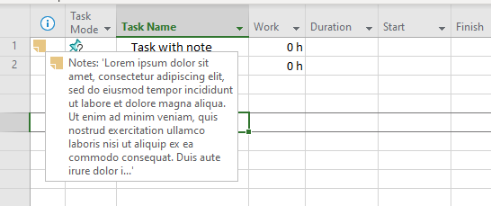
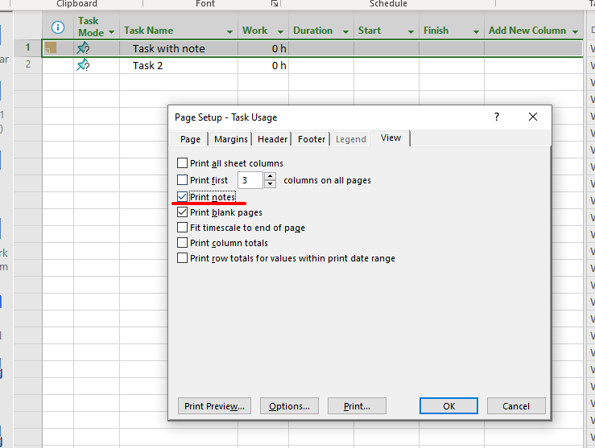

MS Project allows the user to add notes for task, resource or assignment. Notes field contains comment in Rich Text Format:
.

MS Project has "Print notes" setting in view's "Page Setup" dialog. The setting allows the notes to be rendered when project is saved to PDF via "Save As" command.

## **Rendering Task, Resource or Assignment Notes When Converting Project Using Aspose.Tasks for .NET**
Aspose.Tasks for .NET provides [PageViewSettings](https://reference.aspose.com/tasks/net/aspose.tasks.visualization/pageinfo/properties/pageviewsettings).[PrintNotes](https://reference.aspose.com/tasks/net/aspose.tasks.visualization/pageviewsettings/properties/printnotes) flag property to determine whether to print notes under [PageInfo](https://reference.aspose.com/tasks/net/aspose.tasks.visualization/pageinfo).

The following code snippets demonstrates how to enable rendering of task, resource or assignment's comments when saving the project as an image, HTML or PDF file.



The notes are rendered on last page(-s) of the resulting document.
