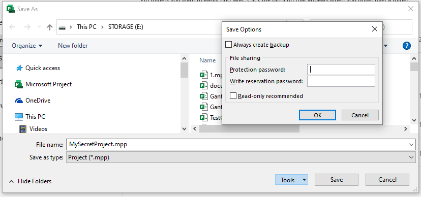

Microsoft Project allows the user to add password protection when saving project in MPP format: 

Now consider how Aspose.Tasks for .NET can be used to work with password protected projects saved in MPP format:

## **Read Password Protected Projects**
The [Project](https://apireference.aspose.com/tasks/net/aspose.tasks/project) class exposes the Project() constructor overloads which allows to read password-protected MPP files.

To read a password-protected project file you can either 

1. Use a Project(string, string) constructor overload and pass the password as a second argument:


Project project = new Project("New Project.mpp", "password");


Or 

2. Use a Project(string, LoadOptions) constructor overload in the following way:


Project project = new Project("New Project.mpp", new LoadOptions { Password = "password" } );


The following code example demonstrates how to check if the project file is password protected.


var info = Project.GetProjectFileInfo("PasswordProtected.mpp");
Console.WriteLine("Is file password protected?:" + info.IsPasswordProtected);


## **Add Password Protection**

Aspose.Tasks for .NET can add password protection when writing project in MPP format.

The feature is subject to the following restrictions:

- Adding of protection password is supported for projects in MPP saved by Microsoft Project 2010 and newer formats.
- Currently only "Protection password" is supported, support of "Write reservation password" will be added in a future release.

The following snippet can be used to add protection password :


Project project = new Project("Test project.mpp");
project.Save("output_protected.mpp",
    new MPPSaveOptions()
    {
        ProtectionPassword = "password"
    });



Please note that once password-protection project is saved using Aspose.Tasks for .NET without specifying the ProtectionPassword, it becomes unprotected.
Thus in the example below the output.mpp is not protected.


Project project = new Project("ProtectedFile", "password");

project.Save("output.mpp", SaveFileFormat.MPP);
// output.mpp file is not protected

project.Save("output_protected.mpp", new MPPSaveOptions()
    {
        ProtectionPassword = "password"
    });

// output_protected.mpp file is protected.

