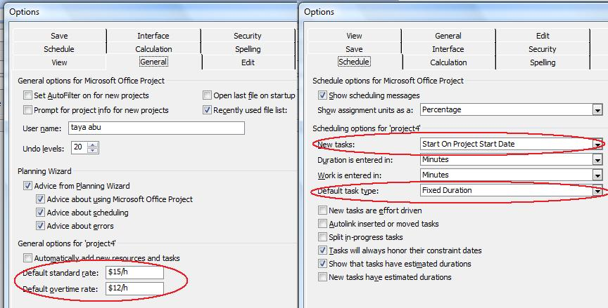
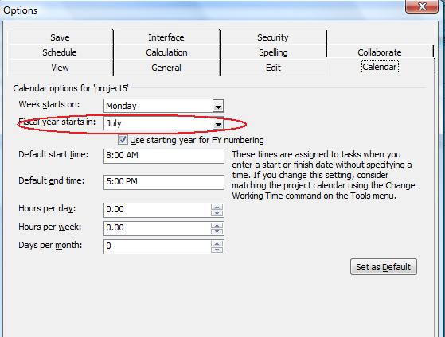

## **Project Calculation Modes**
Aspose.Tasks for .NET API provides three project calculation modes where each mode's output is different based on the selection. These calculation modes are:

- None - Sets only necessary properties and does not perform any calculations
- Manual - Sets only dependent object properties without recalculation of any other data
- Automatic-Recalculates dates, work and cost properties automatically

This examples below shows the usage of each of these with the help of code samples.
### **Project Calculation Mode - None**

### **Project Calculation Mode - Manual**

### **Project Calculation Mode - Automatic**

## **Working with General Project Properties**
Microsoft Project saves project properties, metadata, for every project. The properties include the project's start and end dates, the current date and the status date, the type of calendar used and when a project is scheduled from. Aspose.Tasks lets you [read](https://apireference.aspose.com/tasks/net/aspose.tasks/project/methods/get/_1) and [set project properties](https://apireference.aspose.com/tasks/net/aspose.tasks/project/methods/set/_1), which is shown below.

{} 

Please note that you cannot set values against the **Application** and **Producer** fields, because Aspose Ltd. and Aspose.Tasks for .NET x.x.x will be displayed against these fields

{} 

### **Reading Project Information**
The [Project](https://apireference.aspose.com/tasks/net/aspose.tasks/project) class has a number of properties that deal with project properties:

- **StartDate**: the project's start date, of the DateTime data type.
- **FinishDate**: the project's end date, of the DateTime data type.
- **CurrentDate**: the current date, of the DateTime data type.
- **StatusDate**: the date that the project's progress will be reported, of the DateTime data type.
- **IsScheduleFromStart**: defines whether the project is scheduled from the start or end data and takes a Boolean value.
- **Calendar**: the type of calendar used by the project, managed through the [Aspose.Tasks.Calendar](https://apireference.aspose.com/tasks/net/aspose.tasks/calendar) class.

To read project properties in Microsoft Project, click **Project Information** on the **Project** menu.

The programming samples below show how to read and output the project start and end date, whether the project is scheduled from the start or end, author, last author, revision, keywords and comments.


### **Writing Project Information**
Aspose.Tasks for .NET can write as well as [read project information](https://apireference.aspose.com/tasks/net/aspose.tasks/project/methods/get/_1). The code samples below show how to set author, last author, revision, keywords and comments..



## **Determining Project Version**
Aspose.Tasks for .NET API provides the capability to retrieve project file information with simple API calls. The [Project](https://apireference.aspose.com/tasks/net/aspose.tasks/project) class's [Get](https://apireference.aspose.com/tasks/net/aspose.tasks/project/methods/get/_1) method facilitates users to retrieve Project related information using the static class [Prj](https://apireference.aspose.com/tasks/net/aspose.tasks/prj). The Prj class exposes a number of properties related to the Project. This topic shows how to retrieve version information.

The SaveVersion and LastSaved properties exposed by the Prj class are used to determine the project version and the date when the project was last saved. SaveVersion supports the Integer data type, whereas LastSaved supports the DateTime data type.


## **Default Project Properties**
Microsoft Project lets users set default project properties that speed up the process of setting up a project. The default properties define when a new task starts and finishes, sets the default overtime and standard pay rates and more. Aspose.Tasks supports these features.

The [Prj](https://apireference.aspose.com/tasks/net/aspose.tasks/prj/fields/index) exposes a number of properties for managing a project's default properties:

- **DefaultStartTime**: a new tasks' default start time, takes a DateTime value.
- **DefaultFinishTime**: a new tasks' default finishing time, takes a DateTime value.
- **DefaultFixedCostAccrual**: an assignment's default fixed cost accrual, takes one of the values defined by the [CostAccrualType](https://apireference.aspose.com/tasks/net/aspose.tasks/costaccrualtype) enumeration.
- **DefaultStandardRate**: the default standard pay rate, takes a double.
- **DefaultOvertimeRate**: the default overtime pay rate, takes a double.
- **DefaultTaskEVMethod**: the default task earned value method, takes one of the values defined by the [EarnedValueMethodType](https://apireference.aspose.com/tasks/net/aspose.tasks/earnedvaluemethodtype) enumeration.
- **DefaultTaskType**: the project's default task type, takes one of the values defined by the [TaskType](https://apireference.aspose.com/tasks/net/aspose.tasks/tasktype) enumeration.

To see the default project information in Microsoft Project:

1. Open a project.
2. On the **Tools** menu, click **Options**.
3. Go to the **General** tab.
   Here, you can see the settings for the default standard and overtime rates.
4. Go to the **Schedule** tab.
   Here, you can see the settings for the default task type and default task start time.

## **Default project information in Microsoft Project, as written by Aspose.Tasks** 

### **Reading Default Properties**
The following example reads a project's default properties and writes them to a console window.


### **Writing Default Properties**
The following lines of code set a project's default properties.


## **Writing Project Summary Information**
Most programs save summary information with the files they save. Microsoft Project is no different. As well as the name of the author, the date the project was created and the last time it was edited and saved, it saves keywords, subject, comments and more. Aspose.Tasks lets you both read and write this type of information.

The Project's class [Set](https://apireference.aspose.com/tasks/net/aspose.tasks/project/methods/set/_1) method can be used to write and [Get](https://apireference.aspose.com/tasks/net/aspose.tasks/project/methods/get/_1) method can be used to read Project summary information using the [Prj](https://apireference.aspose.com/tasks/net/aspose.tasks/prj) class's members. The file can be saved back after updating the summary information. To update the project summary information of an existing MPP file:

1. Create an instance of [Project](https://apireference.aspose.com/tasks/net/aspose.tasks/project) class
2. Set the various properties exposed by the [Prj](https://apireference.aspose.com/tasks/net/aspose.tasks/prj) class to define summary information.
3. Save the Project using the [Save](https://apireference.aspose.com/tasks/net/aspose.tasks.project/save/methods/5) method of [Project](https://apireference.aspose.com/tasks/net/aspose.tasks/project) class

To see the file's summary information:

1. Find the file in a file browser.
2. Right-click the file and select **Properties**.
3. Go to the **Details** tab.

The code sample below writes project summary information to MPP file.


## **Fiscal Year Properties**
The fiscal year is the same as a financial year or budget year. It is the dates between which a country, an organization or an individual calculate budgets and taxes. Microsoft Project lets users define a fiscal year for projects. Aspose.Tasks supports this functionality with properties that allow developers to both **read fiscal year properties** from existing projects, and **set fiscal year properties** when creating or working with projects.

The [Prj](https://apireference.aspose.com/tasks/net/aspose.tasks/prj) class exposes the [FyStartDate](https://apireference.aspose.com/tasks/net/aspose.tasks/prj/fields/fystartdate) and [FiscalYearStart](https://apireference.aspose.com/tasks/net/aspose.tasks/prj/fields/fiscalyearstart) properties used to manage fiscal year for a project:

- **FyStartDate**: define the fiscal year start month and supports one of the values defined by the Month enumeration.
- **FiscalYearStart**: determines whether the fiscal year numbering has been used in the project. Boolean.
### **Reading Fiscal Year Properties**
The FyStartDate and FiscalYearStart properties make it easy to find out what the current fiscal year start date is, and whether fiscal year numbering is used, with Aspose.Tasks.

The following code reads a project's fiscal year properties and displays them in a console window.


### **Writing Fiscal Year Properties**
To see fiscal year properties in Microsoft Project:

1. Open a project file.
2. On the **Tools** menu, click **Options**.
3. Click the **Calendar** tab. It will look like the one shown below.

## **Checking that the fiscal year properties have been set in Microsoft Project.**

The following example writes the fiscal year properties of the project.


## **Weekday Properties**
Microsoft Project lets users set a number of different weekday properties. For example, what day a week starts on and how many working days are in a month. Aspose.Tasks support these features through a number of properties that can be used both to **read weekday properties** and to **write them to a project**.

Aspose.Tasks has a series of properties, exposed by the [Project](https://apireference.aspose.com/tasks/net/aspose.tasks/project) class, specifically for managing a project's weekday properties:

- **WeekStartDay**: the first day of the week. This property takes values defined by the [DayType](https://apireference.aspose.com/tasks/net/aspose.tasks/daytype) enumeration.
- **DaysPerMonth**: the number of working days in a month, passed as an integer.
- **MinutesPerDay**: the number of working minutes in a working day, passed as an integer.
- **MinutesPerWeek**: the number of working minutes in a working week, passed as an integer.
### **Reading Weekday Properties**
The following code reads a project's weekday properties and writes them to a console window.


### **Writing Weekday Properties**
To see weekday properties in Microsoft Project:

1. Open a file.
2. On the **Tools** menu, click **Options**.
3. Select the **Calendar** tab. It will look something like the example below.

## **Viewing weekday properties in Microsoft Project** 

The following code writes weekday properties, as shown in the screenshot above, to a project.



## **Currency Properties**
Microsoft Project lets users set which currency costs are shown in, in a project. They can define set the currency code, numbers after the decimal point and currency symbol so that costs show in an easy to read and intuitive way. Aspose.Tasks supports these features and provides a series of properties that help developers set and control currency properties. This topic explains both how to [read currency properties](/tasks/net/working-with-project-properties/), and [how to set them](/tasks/net/working-with-project-properties/).

Aspose.Tasks provides properties exposed by the [Prj](https://apireference.aspose.com/tasks/net/aspose.tasks/prj) class, for managing currency properties:

- [CurrencyCode](https://apireference.aspose.com/tasks/net/aspose.tasks/prj/fields/currencycode): the three-letter currency code, for example, USD, GBP or AUD, passed as a string.
- [CurrencyDigits](https://apireference.aspose.com/tasks/net/aspose.tasks/prj/fields/currencydigits): the number of numbers after the decimal point, for example, 2 (100.00) or 3 (100.000), passed as an integer.
- [CurrencySymbol](https://apireference.aspose.com/tasks/net/aspose.tasks/prj/fields/currencysymbol): the currency symbol, for example, $ or £, passed as a string.
- [CurrencySymbolPosition](https://apireference.aspose.com/tasks/net/aspose.tasks/currencysymbolpositiontype): the position of the currency symbol, for example before ($100) or after (100$). CurrencySymbolPosition takes a value from the [CurrencySymbolPositionType](https://apireference.aspose.com/tasks/net/aspose.tasks/currencysymbolpositiontype) enumeration.
### **Reading Currency Properties**
The following piece of code reads a project's currency properties.


### **Writing Currency Properties**
To see the currency properties in Microsoft Project:

1. Open the project file.
2. On the **Tools** menu, select **Options**.
3. Click the **View** tab. It will look like the one shown below.

## **Reading currency properties in Microsoft Project** 

The following example writes currency properties to the project.


## **Setting Attributes for New Tasks**
Microsoft Project allows to set default properties for new tasks added. This topic explains how to set the default start date for new tasks using Aspose.Tasks for .NET API.

The [Prj](https://apireference.aspose.com/tasks/net/aspose.tasks/prj) class exposes the [NewTaskStartDate](https://apireference.aspose.com/tasks/net/aspose.tasks/prj/fields/newtaskstartdate) property that defines the start date for a new task. This property supports the values defined by the [TaskStartDateType](https://apireference.aspose.com/tasks/net/aspose.tasks/taskstartdatetype) enumeration type.

To see the task attributes:

1. Open the file with Microsoft Project.
2. On the **Tools** menu, select **Options**.
3. Select the **Schedule** tab.
   The tab looks like the one shown below.

**New tasks set to start on the current date** 

The following lines of code set the new task start date.


## **Reading Custom and Built-in Properties**
In Aspose.Tasks, the custom properties are available through the typed collection whereas the built-in properties are available directly.

The following code example demonstrates how to read custom and built-in properties.


