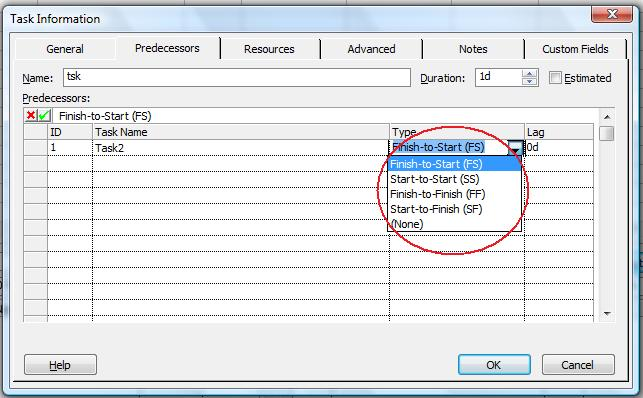

The [LinkType](https://reference.aspose.com/tasks/net/aspose.tasks/tasklink/properties/linktype) property exposed by the [TaskLink](https://reference.aspose.com/tasks/net/aspose.tasks/tasklink) class is used to retrieve or define the type of link between two tasks. It reads and writes one of the values defined by the [TaskLinkType](https://reference.aspose.com/tasks/net/aspose.tasks/tasklinktype) enumeration type.

## **Defining Link Type**
To define link type in Microsoft Project:

1. On the **View** menu, select **More Views** and then **Task Entry Form**.
2. Double-click the desired task.
3. Select the **Predecessor** tab.

### **Setting Link Type with Aspose.Tasks**
The code samples below set a link type as "Start-to-Start”, the default link type is "Finish-to-Start”.



### **Getting Link Type with Aspose.Tasks**
The code samples below display link types by traversing the task links in the project and printing the result to a console window.


