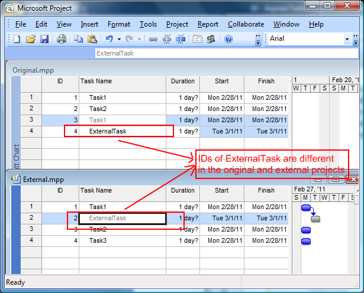

## **How to Identify Cross Project Tasks**
If you have linked a task from one project to a task from the other project, the IDs and UIDs of the task is different in the original and external projects as you can see in the following image.

**Internal and external IDs in Microsoft Project** 

The ExternalId property exposed by the [Task](https://www.aspose.com/api/net/tasks/aspose.tasks/task) class is used to find an external task's original ID. The Id property returns the ID of the external task in the **external** project whereas the ExternalId property returns the ID of the external task in the **original** project.

The code below finds the original and external ID of a task.


