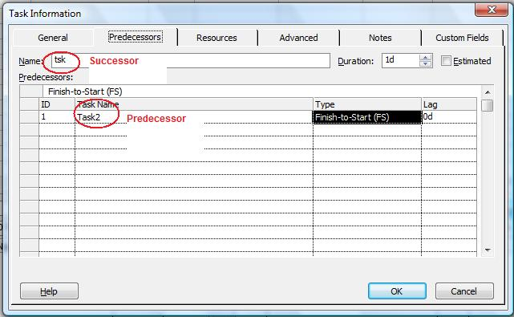

{} 

The [PredTask](https://apireference.aspose.com/tasks/net/aspose.tasks/tasklink/properties/predtask) and [SuccTask](https://apireference.aspose.com/tasks/net/aspose.tasks/tasklink/properties/succtask) properties exposed by the [TaskLink](https://apireference.aspose.com/tasks/net/aspose.tasks/tasklink) class are used to define the predecessor and successor tasks for a TaskLink. Both of these properties read and write a [Task](https://apireference.aspose.com/tasks/net/aspose.tasks/task) object.

{} 
## **Working with Predecessor and Successor Tasks**
To manage predecessor tasks in Microsoft Project:

1. From the **View** menu, select **More Views** and then **Task Entry Form**.
1. Double-click the desired task.
1. Select the Predecessor tab.

**Viewing predecessor tasks in Microsoft Project** 

### **Getting Predecessor Tasks with Aspose.Tasks**
The code samples below displays predecessor and successor task after traversing the task links in the project and writing the results to a console window.


