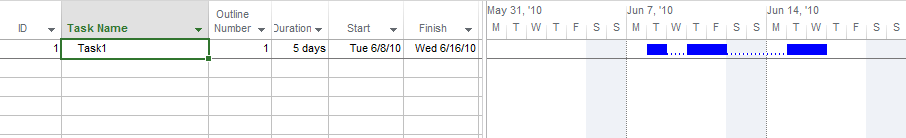

{} 

Microsoft Project allows users to split tasks when the schedule is interrupted. Aspose.Tasks allows you to calculate the finishing date of a split task.

{} 
## **Split Tasks**
The [GetTaskFinishDateFromDuration](https://apireference.aspose.com/tasks/net/aspose.tasks/calendar/methods/gettaskfinishdatefromduration) method exposed by the [Calendar](https://apireference.aspose.com/tasks/net/aspose.tasks/calendar) class is used to calculate a split task's finishing date from the start date, split parts and duration. The [GetTaskFinishDateFromDuration](https://apireference.aspose.com/tasks/net/aspose.tasks/calendar/methods/gettaskfinishdatefromduration) method takes a split task and duration as its arguments and returns the tasks finish date.
### **Split Tasks in Microsoft Project**
To view the start date of a split task in Microsoft Project:

1. From the **View** menu, select **Gantt Chart**.
   The parts of a split task are connected by a line of dots.

**The split task in Microsoft Project** 

### **Calculating a Split Task's Finish Date with Aspose.Tasks**
The following code examples calculate a split task's finish date.


