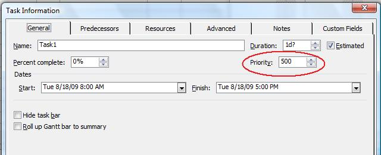

{} 

A task's priority helps Microsoft Project with automatic resource levelling (a process of fixing conflicts when a resource is over-allocated). In Microsoft Project, it is possible to assign priority values between 0 and 1000 (where 0 is the lowest priority). By default, tasks are assigned the value 500.

{} 
## **Working with Priorities**
The priorities associated with a class are handled through the Priority property exposed by the [Tsk](http://www.aspose.com/api/net/tasks/aspose.tasks/tsk) class.

- Priority: a task's priority (an integer between 1 and 1000).
### **Priorities in Microsoft Project**
To see a task's priority in Microsoft Project:

1. Double-click a task in the Task Entry form.

**Task priority in Microsoft Project** 

### **Getting a Task's Priority**
The following examples show how to get a task's priority and write it to a console window using Aspose.Tasks.


