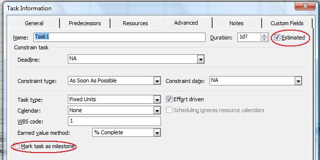

In Microsoft Project, milestones are used to monitor a project's progress. Milestones are crucial points in the project. Typically, a milestone's a task with no duration but any task can be marked as a milestone. Aspose.Tasks helps you manage milestones.

## **Working with Milestones**
The [Task](https://reference.aspose.com/tasks/net/aspose.tasks/task) class exposes the [IsEstimated](https://reference.aspose.com/tasks/net/aspose.tasks/tsk/fields/isestimated) and [IsMilestone](https://reference.aspose.com/tasks/net/aspose.tasks/tsk/fields/ismilestone) properties to manage estimated and milestone tasks:

- IsEstimated: set and get whether a task is estimated (boolean).
- IsMilestone: set and get whether a task is a milestone (boolean).

### **Viewing Estimated and Milestone Tasks in Microsoft Project**
To check whether a task is estimates of marked as a milestone in Microsoft Project one need to double-click on a task in the Task Entry form:

### **Finding out Whether a Task is Estimated or a Milestone**
The following code examples show how to find out whether a task is estimated or a milestone using Aspose.Tasks.


