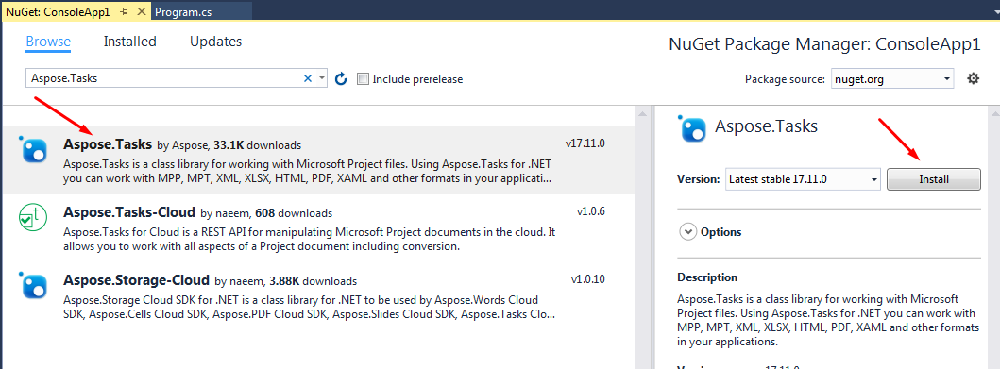
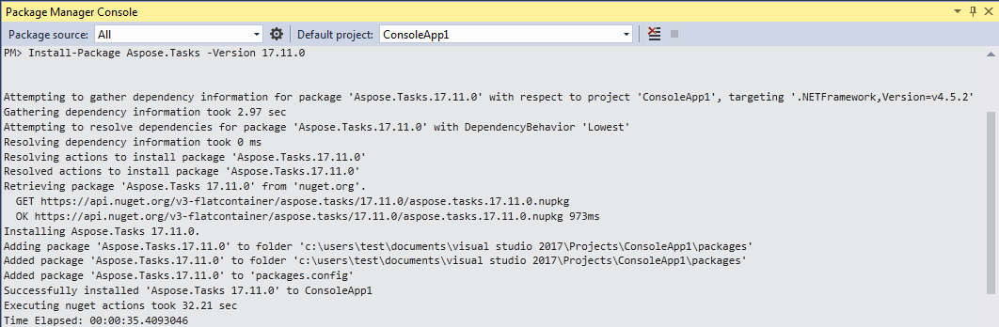
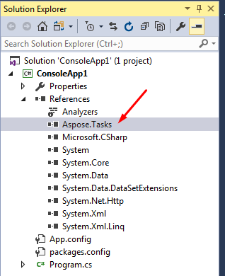

## **Installing Aspose.Tasks for .NET through NuGet**
NuGet is the easiest way to download and install Aspose APIs for .NET. Open Microsoft Visual Studio and NuGet package manager. Search "aspose" to find the desired Aspose API. Click on "Install", the selected API will be downloaded and referenced in your project.

## **Install or Update Aspose.Tasks using the Package Manager Console**
You can follow the steps below to reference the Aspose.Tasks for .NET API using the package manager console:

1. Open your solution/project in Visual Studio.
2. Select Tools -> Library Package Manager -> Package Manager Console from the menu to open the package manager console.

Type the command "**Install-Package Aspose.Tasks -Version 20.12.0**” and press enter to install the latest full release into your application. Alternatively, you can add the "**-prerelease**" suffix to the command in order to specify that the latest release including hot fixes is to be installed as well.

You should now find that Aspose.Tasks has successfully been added and referenced in your application for you.

## **Uninstalling Aspose.Tasks for .NET**
If you installed Aspose.Tasks using the MSI installer, you can remove the component and the associated demos and documentation:

1. On the **Start** menu, select **Settings** and then **Control Panel**.
2. Click **Add/Remove Programs**.
3. Select **Aspose.Tasks**.
4. Click **Change/Remove** to remove Aspose.Tasks.
