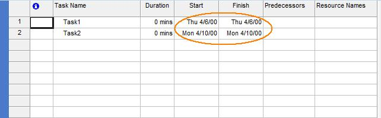

## **Evaluate Aspose.Tasks**
A free evaluation version of Aspose.Tasks for .NET can be downloaded from downloads section of Aspose's web site at <http://www.aspose.com/community/files/51/.net-components/aspose.tasks-for-.net/default.aspx>.

{} 

If you want to test Aspose.Tasks without evaluation version limitations, you can also request a 30 Day Temporary License. Please refer to [How to get a Temporary License](http://www.aspose.com/corporate/purchase/temporary-license.aspx)?

{} 
### **PDF Creator Information**
- Please note that you cannot set values against the **Application** and **Producer** fields, because Aspose Ltd. and Aspose.Tasks  for .NET x.x.x will be displayed against these fields.
### **Evaluation Limitations**
The evaluation version provides all the features except the following:
#### **DateTime Limitation**
The date year will be converted to 2000 in the projects that will be written through Aspose.Tasks for .NET as explained in the following code example. This example tries to create a project with two tasks through Aspose.Tasks for .NET without using license file.

The project file created from the code looks like the one below in Microsoft Project. Note that the Start and Finish dates for Task1 have been converted from 06-Apr-2010 to 06-Apr-2000. Similarly, the Start and Finish dates for Task2 have been converted from 10-Apr-2010 to 10-Apr-2000. These dates are written with the same original year if the project is created using a [licensed version of Aspose.Taks for .NET](/pages/createpage.action?spaceKey=tasksnet&title=Applying+the+License&linkCreation=true&fromPageId=16286445).

|**Date changes in the evaluation version of Aspose.Tasks**|
| :- |
||

#### **MPP Write Support**
Aspose.Tasks for .NET supports reading MPP files, updating the project summary information and then writing updated project files in original the MPP format. That is, if original MPP format belongs to Microsoft Project 2003 version, the MPP file updated through Aspose.Tasks for .NET will also be in Microsoft Project 2003 MPP format. The same is valid for Microsoft Project 2007, 2010 and 2013 MPP formats. However, this support is only available in licensed versions of Aspose.Tasks for .NET.
## **Applying the License**
Once you are happy with your [evaluation](/pages/createpage.action?spaceKey=tasksnet&title=Evaluate+Aspose.Tasks&linkCreation=true&fromPageId=16286445) of Aspose.Tasks for .NET, buy a license at the Aspose website: <http://www.aspose.com/purchase/default.aspx>. Make yourself familiar with the different [licenses](http://www.aspose.com/corporate/purchase/policies/License-Types/default.aspx) offered. If you have any questions, [contact the Aspose sales team](http://www.aspose.com/corporate/contact/default.aspx) and they'll be happy to help you.

Every Aspose license carries a one-year [subscription](http://www.aspose.com/corporate/purchase/policies/Subscriptions.aspx) for free upgrades to any new versions or fixes that come out during this time. Technical support is free and unlimited and provided both to licensed and evaluation users.

The license is a plain text XML file that contains details such as the product name, number of licensed developers, subscription expiry date and so on. The file is digitally signed, so do not modify the file: even adding an extra line break to the file invalidates it.
### **When to Apply a License**
Follow these simple rules:

- The license only needs to be set once per application domain.
- You need to set the license before using any other Aspose.Tasks classes.
- Calling SetLicense multiple times is not harmful, but wastes processor time.
- If you are developing a Windows Forms or console application, call SetLicense in your startup code, before using Aspose.Tasks classes.
- When developing an ASP.NET application, you can call SetLicense from the Global.asax.cs (Global.asax.vb) file, in the Application_Start protected method. It is called once when the application starts.
- Do not call SetLicense from within the Page_Load methods since it means the license will be loaded every time a web page is loaded.
- If you are developing a class library, call SetLicense from a static constructor of your class that uses Aspose.Tasks. The static constructor executes before an instance of your class is created making sure that the Aspose.Tasks license is properly set.
### **Applying a License**
Use the **License.SetLicense** method to license the component. The easiest way to set a license is to put the license file in the same folder as the Aspose.Tasks.dll and specify the file name, without a path, as shown below.
#### **Applying a License Using File or Stream**
This code snippet initializes a license stored in a file or in an embedded resource.



This code snippet initializes a license from a stream.



#### **Applying a Licenses Using an Embedded Resource**
Another neat way of packaging the license with your application and making sure it will not be lost, is to include it as an embedded resource into one of the assemblies that calls the component's DLL (included in Aspose.Email). To include the license file as an embedded resource, perform the following steps:

1. In Visual Studio .NET, include the license (.lic) file into the project using the **Add Existing Item** on the **File** menu.
1. Select the file in the Solution Explorer.
1. Set **Build Action** to **Embedded Resource** in the Properties window.

To access the license embedded in the assembly (as embedded resource), you don't have to call the Microsoft .NET Framework's System.Reflection.Assembly class' GetExecutingAssembly and GetManifestResourceStream methods. Instead, just add the license file as an embedded resource to your project and pass the name of the license file to the [License](/pages/createpage.action?spaceKey=tasksnet&title=License+class&linkCreation=true&fromPageId=16286445) class' [SetLicense](/pages/createpage.action?spaceKey=tasksnet&title=SetLicense+Method&linkCreation=true&fromPageId=16286445) method. The License class will automatically find the license file in the embedded resources.
