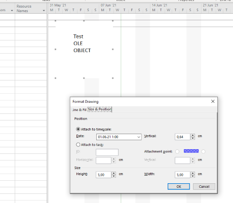

{} 

This page contains release notes information for [Aspose.Tasks for .Net 21.6](https://downloads.aspose.com/tasks/net/new-releases/-aspose.tasks-for-.net-21.6/).

{}
## **All Changes**
|**Key**|**Summary**|**Issue Type**|
| :- | :- | :- |
| TASKSNET-4903 | Add ExecutingWebRequest event for interactions with API of ProjectOnline \ ProjectServer. | Enhancement |
| TASKSNET-4696 | Add support of 'Display OLE as Icon' property | Enhancement |
| TASKSNET-4908 | Fix resaving of the specific MPP file throws ArgumentOutOfRangeException | Bug |
| TASKSNET-4907 | Fix resaving of the specific MPP file throws 'Project writing exception' | Bug |
| TASKSNET-4904 | Fix OLE object frame remains even after removing ole object | Bug |
| TASKSNET-4876 | Fix incorrect timephased data for assignment with zero work. | Bug |
| TASKSNET-4866 | Fix setting of assigned task duration not recalculating correctly for the first task | Bug |
| TASKSNET-4854 | Fix  updating of assignment's TimephasedData | Bug |
| TASKSNET-4850 | Fix "File reading error." exception when open document MPX file | Bug |
| TASKSNET-4734 | Fix failed resave to MPX format | Bug |
| TASKSNET-4698 | Fix incorrect percentages in exported MPP file | Bug |

## **Public API and Backwards Incompatible Changes**
|**The following public types were added:**|**Description**|
| :- | :- |
| Aspose.Tasks.Visualization.FillPattern | Fill pattern used in middle shape of a gantt bar. |
| Aspose.Tasks.Visualization.HorizontalAlignment | Specifies how an object or text is horizontally aligned relative to another object. |
| Aspose.Tasks.Visualization.VisualObjectPlacement | Represents placement and appearance of <see cref="T:Aspose.Tasks.OleObject" /> in a view. |
| Aspose.Tasks.WebRequestEventArgs | Provides arguments for the event that is raised when the client sends a web request to the Project Server's web API. |

|**The following public methods and properties were added:**|**Description**|
| :- | :- |
| Aspose.Tasks.OleObject.Id | Gets the object id. |
| Aspose.Tasks.OleObject.DisplayAsIcon | Gets a flag indicating that OLE object should be shown either as an icon or as its regular picture. |
| Aspose.Tasks.ProjectServerManager.ExecutingWebRequest | An event that is raised when the web request is sent to Project Server's web API. |
| Aspose.Tasks.View.VisualObjectsPlacements | Gets a collection of objects representing placement and appearance of <see cref="T:Aspose.Tasks.OleObject" /> in the view. |
| Aspose.Tasks.Visualization.VisualObjectPlacement.OleObjectId | Gets Id of <see cref="T:Aspose.Tasks.OleObject" /> object. |
| Aspose.Tasks.Visualization.VisualObjectPlacement.TaskId | Gets Id of task if 'Attach to task' options is selected, -1 otherwise. |
| Aspose.Tasks.Visualization.VisualObjectPlacement.Width | Gets displayed width of visual object. |
| Aspose.Tasks.Visualization.VisualObjectPlacement.Height | Gets displayed height of visual object. |
| Aspose.Tasks.Visualization.VisualObjectPlacement.VerticalOffset | Gets vertical offset of visual object. |
| Aspose.Tasks.Visualization.VisualObjectPlacement.HorizontalOffset | Gets horizontal offset of visual object. |
| Aspose.Tasks.Visualization.VisualObjectPlacement.TimescaleDate | Gets date placement of visual object when 'Attach to timescale' options is selected. |
| Aspose.Tasks.Visualization.VisualObjectPlacement.AttachmentPoint | Gets alignment of visual object relative to a task when 'Attach to task' options is selected. |
| Aspose.Tasks.Visualization.VisualObjectPlacement.BorderLineColor | Gets border line color. |
| Aspose.Tasks.Visualization.VisualObjectPlacement.BorderLineThickness | Gets border line thickness (allowed values are 0 - 5). |
| Aspose.Tasks.Visualization.VisualObjectPlacement.FillColor | Gets fill color. Set to <see cref="P:System.Drawing.Color.Transparent" /> to set the fill to 'None'. |
| Aspose.Tasks.Visualization.VisualObjectPlacement.FillPattern | Gets fill pattern. |
| Aspose.Tasks.WebRequestEventArgs.WebRequest | Gets a web request to sent to the Project Server's web API. |

|**The following public enumerations were added:**|**Description**|
| :- | :- |
| Aspose.Tasks.TaskKey.SV | Represents the SV (Task) field. |
| Aspose.Tasks.Tsk.SV | The earned value schedule variance, through the project status date. |
| Aspose.Tasks.Visualization.FillPattern.Hollow | Hollow pattern. |
| Aspose.Tasks.Visualization.FillPattern.SolidFill | Solid fill pattern. |
| Aspose.Tasks.Visualization.FillPattern.LightFill | Light fill pattern. |
| Aspose.Tasks.Visualization.FillPattern.MediumFill | Medium fill pattern. |
| Aspose.Tasks.Visualization.FillPattern.DarkFill | Dark fill pattern. |
| Aspose.Tasks.Visualization.FillPattern.DiagonalLeft | Diagonal left pattern. |
| Aspose.Tasks.Visualization.FillPattern.DiagonalRight | Diagonal right pattern. |
| Aspose.Tasks.Visualization.FillPattern.DiagonalCross | Diagonal cross pattern. |
| Aspose.Tasks.Visualization.FillPattern.LineVertical | Line vertical pattern. |
| Aspose.Tasks.Visualization.FillPattern.LineHorizontal | Line horizontal pattern. |
| Aspose.Tasks.Visualization.FillPattern.LineCross | Line cross pattern. |
| Aspose.Tasks.Visualization.FillPattern.SolidFillWithDashedBorder | Solid with dashed border pattern. |
| Aspose.Tasks.Visualization.HorizontalAlignment.Left | The object is aligned on the left of the target element. |
| Aspose.Tasks.Visualization.HorizontalAlignment.Right | The object is aligned on the right of the target element. |

## **Examples and additional notes**

**Related issue: TASKSNET-4903 - Add ExecutingWebRequest event for interactions with API of ProjectOnline \ ProjectServer.**

Now you can specify custom callback for WebRequest issued during interaction with Project Online \ Project Server via Project Web Access API:

ProjectServerCredentials credentials = new ProjectServerCredentials("http://myprojectserver/sites/pwa", "user", "pwd");
ProjectServerManager manager = new ProjectServerManager(credentials);
manager.ExecutingWebRequest += delegate(object sender, WebRequestEventArgs e)
{
	e.WebRequest.Headers.Add("XMyCustomHeader", "testvalue");
};


**Related issue: TASKSNET-4696 - Add support of 'Display OLE as Icon' property.**

Now you can read OleObject's DisplayAsIcon property to determine whether OLE object should be displayed as icon or as its regular picture.
Also new entity was introduced: ***VisualObjectPlacement*** which represents visual object's (including OleObject) placement and apperance in a project's view.
It corresponds to "Format Drawing" dialog window called by "Properties" command from OleObject's (or another visual object in a view) context menu:


Project project = new Project("ProjectWithOleObjects.mpp");
var view = project.Views.GetByName("&Gantt Chart");
var oleObject = project.OleObjects.First(o => o.Id == 1);

Console.WriteLine("First OLE object: {0}", oleObject.Name);
Console.WriteLine("DisplayAsIcon: {0}", oleObject.DisplayAsIcon);

var oleObjectPlacement = view.VisualObjectsPlacements.First(v => v.OleObjectId == 1);

Console.WriteLine("BorderLineColor: {0}", oleObjectPlacement.BorderLineColor);
Console.WriteLine("BorderLineColor: {0}", oleObjectPlacement.BorderLineThickness);

if (oleObjectPlacement.TaskId > 0)
{
	Console.WriteLine("Attached to task: {0}", oleObjectPlacement.TaskId);
}
else
{
	Console.WriteLine("Attached to timescale date: {0}", oleObjectPlacement.TimescaleDate);
}

