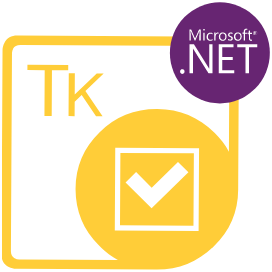

{}

Aspose.Tasks for Python via .NET is a class library that enables Python applications to read and write MPP/XML files without using Microsoft Project software. The component provides an easy to use API for manipulating project files, saving time and money compared to developing similar features from scratch.

{}

The following are the links to some useful resources you may need to accomplish your tasks.

- [Aspose.Tasks for Python via .NET Online Documentation](/tasks/python-net/) 
- [Aspose.Tasks for Python via .NET Features](/tasks/python-net/product-overview/)
- [Aspose.Tasks for Python via .NET Release Notes](/tasks/python-net/release-notes/)
- [Aspose.Tasks for Python via .NET Product Page](https://products.aspose.com/tasks/python-net)
- [Install Aspose.Tasks for Python via .NET package](https://releases.aspose.com/tasks/python-net/)
<!-- [Download Examples at GitHub Repository](https://github.com/aspose-tasks/Aspose.Tasks-for-Python-net) -->
- [Aspose.Tasks for Python via .NET API Reference Guide](https://reference.aspose.com/tasks/python-net)
- [Aspose.Tasks for Python via .NET Free Support Forum](https://forum.aspose.com/c/tasks/15) 
- [Aspose.Tasks for Python via .NET Paid Support HelpDesk](https://helpdesk.aspose.com/)
